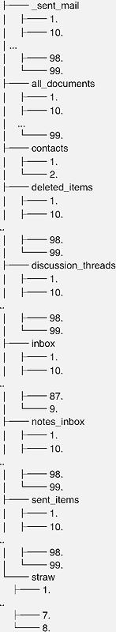
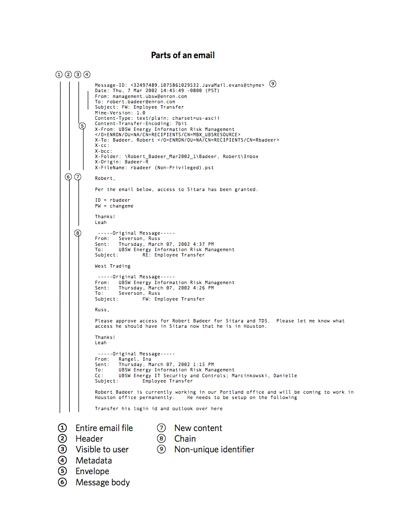
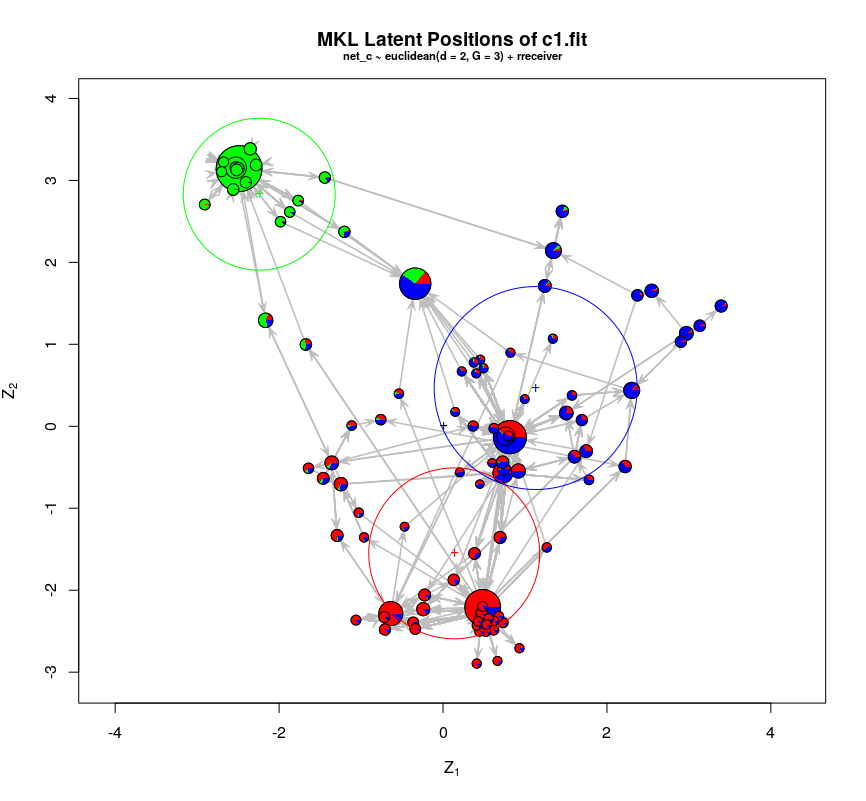
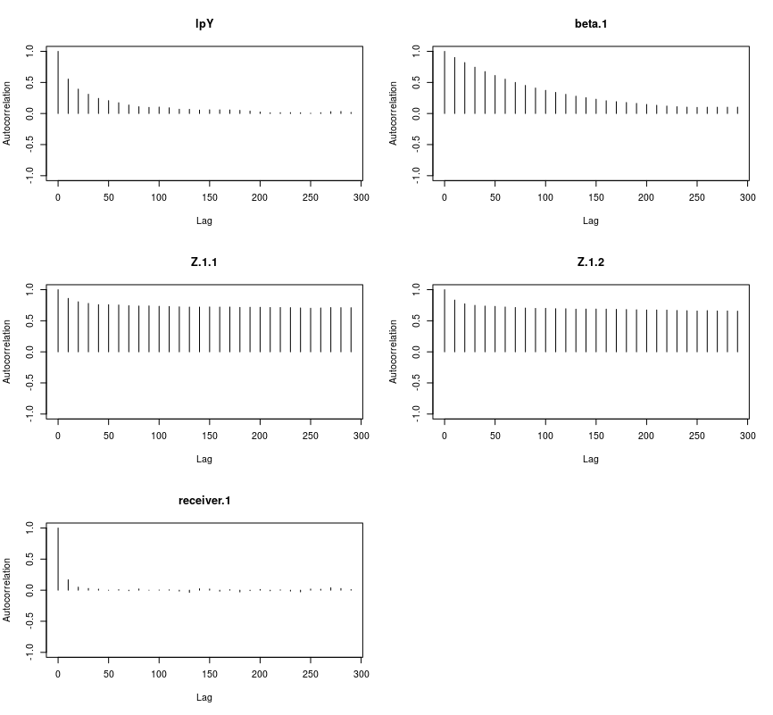
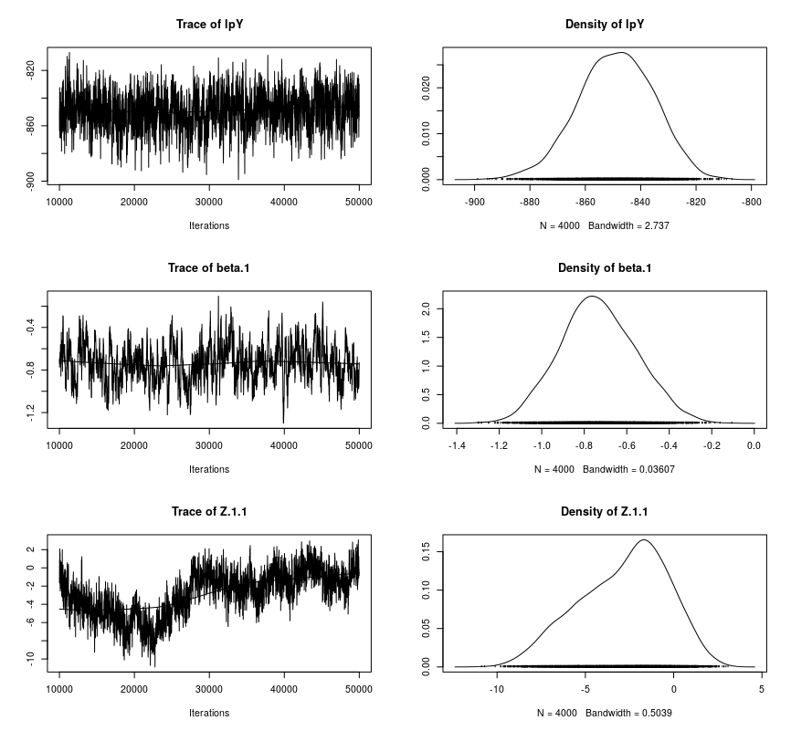
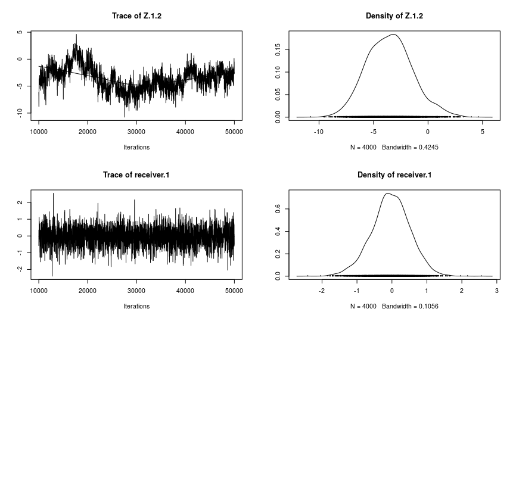

```{r setup, include=FALSE}
knitr::opts_chunk$set(echo = TRUE,  dev = "cairo_pdf", message = FALSE, warning = FALSE, cache = TRUE)

suppressPackageStartupMessages(library(coda))
suppressPackageStartupMessages(library(ggnetwork))
suppressPackageStartupMessages(library(here))
suppressPackageStartupMessages(library(ergm))
suppressPackageStartupMessages(library(GGally))
suppressPackageStartupMessages(library(ggnetwork))
suppressPackageStartupMessages(library(ggthemes))
suppressPackageStartupMessages(library(hrbrthemes))
suppressPackageStartupMessages(library(kableExtra))
suppressPackageStartupMessages(library(knitr))
suppressPackageStartupMessages(library(latentnet))
suppressPackageStartupMessages(library(network))
suppressPackageStartupMessages(library(pander))
suppressPackageStartupMessages(library(sna))
suppressPackageStartupMessages(library(statnet))
suppressPackageStartupMessages(library(statnet.common))
suppressPackageStartupMessages(library(statnet.common))
suppressPackageStartupMessages(library(stringr))
suppressPackageStartupMessages(library(tidytext))
suppressPackageStartupMessages(library(tidyverse))

# load for NLP
data(stop_words)

# make reproducible

set.seed(2203)

# functions

# verb to exclude items from another list

'%out%' <- Negate ('%in%')

# create graph object

netr <- function(x) {
  net <- network(x, matrix.type = "edgelist")
}

# remove isolates: remove disconnected users

neti <- function(x) {
  delete.vertices(x, isolates(x))
}

# format digits to zero places

comma0 <- function(x) format(x, digits = 0, big.mark = ",")

# format digits to two places

comma2 <- function(x) format(x, digits = 2, big.mark = ",")

# number of vertices in a network object

census <- function(x) {
  length(network.vertex.names(x))
}

# vertices names in a network object

cohort <- function(x) {
  network.vertex.names(x)
}

# x is a graph object, y is (possibly empty) string

plot_graph <- function(x,y) {
  ggplot(x, aes(x, y, xend = xend, yend = yend))  +
    geom_edges(size = 0.25, color = "gray")       +
    geom_nodes(size = 0.75, color = "steelblue")  +
    labs(title="Graph of reduced Enron corpus",
         subtitle= y,
         caption="Source: Richard Careaga")			  +
    theme_ipsum_rc()                              +
    theme(legend.position = "none")
}

# x is a graph object, y is (possibly empty) string
# color is a vector of length x
plot_graph_w_nodes <- function(x,y) {
  ggplot(x, aes(x, y, xend = xend, yend = yend))  +
    geom_edges(size = 0.25, color = "gray")       +
    geom_nodes(size = 0.75, color = "steelblue")  +
    geom_nodetext(aes(label = vertex.names,
                      color = sts))               +
  scale_colour_gradient(low = "white",
                        high = "black")           +
  labs(title="Graph of reduced Enron corpus",
         subtitle= y,
         caption="Source: Richard Careaga")			  +
    theme_ipsum_rc()		                        	+
    guides(color = FALSE)                         +
    theme_void()
}

# end functions

# email recipient cleanser patterns

faux_nl   	<-	"\\\n"
left_brak	  <-	"\\["
right_brak	<-	"\\]"
quote_s     <-  "'"

# load source data
# con <- url("https://s3-us-west-2.amazonaws.com/dslabs.nostromo/enron.Rda")
# load(con)
# close(con)
#save(enron, file = "data/enron.Rda")
load("data/enron.Rda")

# save for Rmd inline

size_of_enron <- nrow(enron)

# begin data cleansing

# remove spurious characters from recipients field, 'tos'
# g_ indicates that tibble will be primarily used for graph purposes

g_enron <- enron 								                		  %>%
  mutate(tos = str_replace_all(tos, faux_nl, ""))		  %>%
  mutate(tos = str_replace_all(tos, left_brak, "")) 	%>%
  mutate(tos = str_replace_all(tos, right_brak, ""))	%>%
  mutate(tos = str_replace_all(tos, quote_s, ""))

# restrict to single recipients
g_enron <- g_enron %>% filter(tosctn == 1 & ccsctn == 0)
singlets <- nrow(g_enron)

# censor non-enron addresses and reduce fields

g_enron <- g_enron                      %>%
filter(str_detect(tos, "enron.com"))    %>%
filter(str_detect(sender, "enron.com")) %>%
select(sender, tos, date, lastword)     %>%
rename(recipient = tos, payload = lastword)

# save for Rmd inline

size_of_g_enron_no_external <- nrow(g_enron)

# remove @enron.com from user names

g_enron  <- g_enron                                           %>%
  mutate(sender = str_replace_all(sender, ".enron.com", ""))  %>%
  mutate(recipient = str_replace_all(recipient, ".enron.com", ""))

# censor internal group addresses

excluded_users <- c(
  "all-hou.dl-bus",
  "all.america",
  "all.employees",
  "center.dl_portland",
  "chick.home",
  "clickathome",
  "clickathomepilot3",
  "dl-ga-all-ews",
  "dl-ga-all_enron_worldwide ",
  "dl-ga-all_enron_worldwide1",
  "dl-ga_all_enron_worldwide2",
  "dl-gal-all_enron_north_america2",
  "enron.chairman",
  "enron.gss",
  "executive.committee",
  "expense.report",
  "group.dl-ets",
  "helpdesk.mailman",
  "info",
  "outlook.team",
  "perfmgmt",
  "perfmgmt@ect",
  "portland",
  "portland.desk",
  "portland.shift",
  "sap_security",
  "the.globalist",
  "traders.eol",
  "trading .williams",
  "transportation.parking",
  "undisclosed-recipients"
)

g_enron <- g_enron %>% filter(sender %out% excluded_users)
g_enron <- g_enron %>% filter(recipient %out% excluded_users)

# save for Rmd inline

size_of_g_enron_no_broadcast <- nrow(g_enron)

# censor emails before 1999-12-31 and after 2001-12-02 and sort
# censor empty rows

g_enron <- g_enron            %>%
  filter(date > "1999-12-31") %>%
  filter(date < "2001-12-03") %>%
  filter(length(payload) > 0) %>%
  arrange(-desc(date))

size_of_g_enron_2000 <- nrow(g_enron)

# end data cleansing

# # create unique identifiers for users to create graph object
#
# # collect unique user names
#
# sender    <- g_enron %>% select(sender)     %>% distinct()
# recipient <- g_enron %>% select(recipient)  %>% distinct()
# colnames(sender)    <- "user"
# colnames(recipient) <- "user"
# users <- bind_rows(sender,recipient)
# users <- users %>% distinct()
#
# # create pool of userids
#
# set.seed(2203)
# user_pool <- seq(1000,nrow(users)+1001,1)
# userid <- enframe(sample(user_pool, nrow(users), replace = FALSE))  %>%
#   select(-name)                                                     %>%
#   rename(userid = value)                                            %>%
#   mutate(userid = as.integer(userid))
#
# userid <- bind_cols(users, userid)
#
# #save(userid, file = "data/userid.Rda")

load("data/userid.Rda")

# for Rmd

unique_users <- nrow(userid)

# rename userid columns to join to g_enron as sender s_uid

colnames(userid) <- c("sender", "s_uid")
g_enron <- left_join(g_enron, userid)

# again for recipient r_uid

colnames(userid) <- c("recipient", "r_uid")
g_enron <- left_join(g_enron, userid)
#save(g_enron, file = "g_enron.Rda")

gclean_enron <- g_enron

#save(gclean_enron, file = "data/gclean_enron.Rda") # "the reduced Enron corpus"

# remove unneed objects from namespace

rm(con, enron, g_enron, faux_nl, left_brak, quote_s, recipient, right_brak, sender,
   user_pool, userid, users)

# begin exploratory analysis

load("data/gclean_enron.Rda")
time_series <- gclean_enron %>% group_by(date) %>% count() %>% ungroup()

# for Rmd summary

distinct_dates <- nrow(time_series)
total_msg  <- sum(time_series$n)
ts_plot <- time_series %>% ggplot(., aes(x = date, y = log10(n))) +
  geom_point(size = 0.75) + geom_smooth()                         +
  xlab("Month")                                                   +
  ylab("Number (log10) of emails by month")                       +
  scale_x_date(date_breaks = "1 month", date_labels = "%Y-%m")    +
  labs(title="Time series chart of reduced Enron corpus",
       subtitle= "January 1, 2000 - December 2, 2001",
       caption="Source: Richard Careaga")			  				          +
  theme_minimal()										                        		  +
  theme(axis.text.x = element_text(angle = 30, hjust = 1))

# create initial graph

net0 <- gclean_enron %>% select(s_uid, r_uid) %>% netr(.)

# for Rmd

net0_vertex_number <- census(net0)
net0_members       <- cohort(net0)

# net0 plot, including isolates

net0_plot <- plot_graph(net0, "Graph of Enron corpus with isolates")

# net1, removing isolates

net1 <- net0 %>% neti(.)

# for Rmd

net1_vertex_number <- census(net1)
net1_members       <- cohort(net1)

# net0 plot, excluding isolates

net1_plot <- plot_graph(net1, "Graph of Enron corpus without isolates")

# for Rmd

# High transitivity
#gt.cg <- gtrans(net1, measure = "strong", use.adjacency = FALSE)
#save(gt.cg, file = "data/gt.cg.Rda")
load("data/gt.cg.Rda")

# Assess measures of centrality on de-isolated graph net1

# calculate measures of centrality
deg   <- degree(net1, rescale = TRUE)
ldctr <- loadcent(net1, rescale = TRUE)
sts   <- stresscent(net1, rescale = TRUE)

# rejected measures of centrality

# btw <- betweenness(net1) # redundant with ldctr
# inf <- infocent(net1) all 1.206801e-13
# cls <- closeness(net1) all 0
# evc <- evcent(net1, use.eigen = TRUE) net1 not symmetrical
# bon <- bonpow(net1) Lapack routine dgesv: system is exactly singular:
# flo <- flowbet(net1) ran 10 minutes without finishing
# flo <- flowbet(net1, cmode = "normflow") ditto
# harg <- graphcent(net1) all 0

vertices    <- net1 %v% 'vertex.names'
vertices    <- enframe(vertices) %>% rename(userid = value) %>% select(-name)
prominence  <- bind_cols(vertices = vertices, deg = deg,
                         ldctr = ldctr, sts = sts)

# prominence with centrality metrics for Rmd

prom_with_ctrs <- nrow(prominence)

# For Rmd

deg_ldctr <- cor.test(deg,ldctr)  # 0.6786184
deg_sts   <- cor.test(deg,sts)    # 0.8656096
ldctr_sts <- cor.test(ldctr,sts)  # 0.7176663


top25_d <- prominence %>% arrange(desc(deg)) %>% head(25) %>% select(userid)
top25_l <- prominence %>% arrange(desc(ldctr)) %>% head(25) %>% select(userid)
top25_s <- prominence %>% arrange(desc(sts)) %>% head(25) %>% select(userid)

top100_s <- prominence %>% arrange(desc(sts)) %>% head(100) %>% select(userid)

# union of the userids with top 25 scores on three measures of centrality 12 +

well_positioned <- union(union(top25_d,top25_l), top25_s)

# core Enron high-centrality exchanges

c_enron <- gclean_enron %>% filter(s_uid %in% top100_s$userid &
                              r_uid %in% top100_s$userid)

net_c <- c_enron %>%  select(s_uid, r_uid) %>% netr(.) %>% neti(.)
net_c_plot <- plot_graph(net_c, "Graph of Enron corpus after 100 sts filter")

# degree centrality

d_enron <- gclean_enron %>% filter(s_uid %in% top25_d$userid &
                              r_uid %in% top25_d$userid)

net_d <- d_enron %>%  select(s_uid, r_uid) %>% netr(.) %>% neti(.)
net_d_plot <- plot_graph(net_d, "Graph of Enron corpus after degree filter")

# load centrality

l_enron <- gclean_enron %>% filter(s_uid %in% top25_l$userid &
                                r_uid %in% top25_l$userid)

net_l <- d_enron %>%  select(s_uid, r_uid) %>% netr(.) %>% neti(.)
net_l_plot <- plot_graph(net_l, "Graph of Enron corpus after loadcent filter")

# both sender and receiver central using strees centrality

c_enron <- gclean_enron %>% filter(s_uid %in% top100_s$userid &
                                 r_uid %in% top100_s$userid)

# for Rmd

size_of_core <- nrow(c_enron)


# either sender or receiver central

c1_enron <- gclean_enron %>% filter(s_uid %in% top100_s$userid |
                                r_uid %in% top100_s$userid)

net_i <- c1_enron %>%  select(s_uid, r_uid) %>% netr(.) %>% neti(.)
i_net <- c_enron %>% netr(.) %>% neti(.)
net_i_plot <- plot_graph(net_i, "Graph of Enron corpus, stresscent intersection")
# c1.fit <- ergmm(net_c1 ~ euclidean(d=2, G=3)+rreceiver,
#                control=ergmm.control(store.burnin=TRUE), seed = 2203)
# save("data/c1.fit.Rda")
load("data/c1.fit.Rda")
pdf("img/c1mcmcdiagnostics.pdf", onefile=TRUE)
mcmc.diagnostics(c1.fit)
dev.off()

plot(c1.fit,pie=TRUE,rand.eff="receiver")
summary(c1.fit)

# Goodnet of fit

c1.gof <- gof(c1.fit)
par(mfrow=c(1,3))
par(oma=c(0.5,2,1,0.5))
plot(c1.gof)
par(mfrow=c(1,3))
par(oma=c(0.5,2,1,0.5))
plot(c1.gof, plotlogodds=TRUE)

#Map userids to clusters

c1.gc <-  enframe(c1.fit$mkl$Z.K) %>%
            select(-name)         %>%
            rename(gcl = value)

c1.gc <- bind_cols(top100_s, c1.gc)

c1.gc <- c1.gc %>% rename(s_uid = userid, s_gcl = gcl)

c1_enron <- left_join(c1_enron, c1.gc)

c1.gc <- c1.gc %>% rename(r_uid = s_uid, r_gcl = s_gcl)

c1_enron <- left_join(c1_enron, c1.gc)

# n_enron for "network"
n_enron <- c1_enron

#save(n_enron, file = "data/n_enron.Rda")
load("data/n_enron.Rda")

# subset by _glc

g1 <- n_enron %>% filter(s_gcl == 1)
g2 <- n_enron %>% filter(s_gcl == 2)
g3 <- n_enron %>% filter(s_gcl == 3)

net1 <- g1 %>% select(s_uid, r_uid) %>% netr(.) %>% neti(.)
net2 <- g2 %>% select(s_uid, r_uid) %>% netr(.) %>% neti(.)
net3 <- g3 %>% select(s_uid, r_uid) %>% netr(.) %>% neti(.)

# For Rmd

# To highlight only the vertices with high degrees of
# centrality using the stresscent measure, the zero-valued
# vertices must be positive; 2 is used due to the subsequent
# log transformation

m <-  as.matrix(stresscent(net1))
m <- m + 2
sts <- round(log(m),1)
net1%v%"sts" <- sts[,1]
clust1_plot <- plot_graph_w_nodes(net1, "Cluster 1")

m <-  as.matrix(stresscent(net2))
m <- m + 2
sts <- round(log(m),1)
net2%v%"sts" <- sts[,1]
clust2_plot <- plot_graph_w_nodes(net2, "Cluster 2")

m <-  as.matrix(stresscent(net3))
m <- m + 2
sts <- round(log(m),1)
net3%v%"sts" <- sts[,1]
clust3_plot <- plot_graph_w_nodes(net3, "Cluster 3")

# short NLP analysis
           
t_all <- gclean_enron                                     %>% 
  select(payload)                                         %>% 
  rename(text = payload)                                  %>%
  mutate(text = str_replace_all(text, "[:punct:]", " "))  %>%
  mutate(text = str_replace_all(text, "[:blank:]", " "))  %>%
  mutate(text = str_replace_all(text, "[:digit:]", " "))  %>%
  unnest_tokens(word, text, to_lower = TRUE)              %>% 
  anti_join(stop_words)                                   %>%
  distinct(word)

t1 <- g1                                                  %>% 
  select(payload)                                         %>% 
  rename(text = payload)                                  %>%
  mutate(text = str_replace_all(text, "[:punct:]", " "))  %>%
  mutate(text = str_replace_all(text, "[:blank:]", " "))  %>%
  mutate(text = str_replace_all(text, "[:digit:]", " "))  %>%
  unnest_tokens(word, text, to_lower = TRUE)              %>% 
  anti_join(stop_words)                                   %>%
  distinct(word)

t2 <- g2                                                  %>% 
  select(payload)                                         %>% 
  rename(text = payload)                                  %>%
  mutate(text = str_replace_all(text, "[:punct:]", " "))  %>%
  mutate(text = str_replace_all(text, "[:blank:]", " "))  %>%
  mutate(text = str_replace_all(text, "[:digit:]", " "))  %>%
  unnest_tokens(word, text, to_lower = TRUE)              %>% 
  anti_join(stop_words)                                   %>%
  distinct(word)

t3 <- g3                                                  %>% 
  select(payload)                                         %>% 
  rename(text = payload)                                  %>%
  mutate(text = str_replace_all(text, "[:punct:]", " "))  %>%
  mutate(text = str_replace_all(text, "[:blank:]", " "))  %>%
  mutate(text = str_replace_all(text, "[:digit:]", " "))  %>%
  unnest_tokens(word, text, to_lower = TRUE)              %>% 
  anti_join(stop_words)                                   %>%
  distinct(word)

t1_words <- nrow(t1)
t2_words <- nrow(t2)
t3_words <- nrow(t3)

tot_words <- t1_words + t2_words + t3_words
 
t1_pct <- t1_words/tot_words
t2t3_pct <- nrow(t2t3)/tot_words
t1_unique <- setdiff(t1,union(t2,t3))
t1_unique_pct <- nrow(t1_unique)/tot_words
t2_unique <- setdiff(t2,union(t1,t3))
t2_unique_pct <- nrow(t2_unique)/tot_words
t3_unique <- setdiff(t1,union(t1,t2))
t3_unique_pct <- nrow(t3_unique)/tot_words

sessinfo <- sessionInfo()

# End of program

```

# Introduction

## Goal

The goal of this paper is to illustrate techniques of social network analysis in combination with natural language processing to identify discrete email subsets in the Enron Corpus.^[The term *corpus* is used in natural language processing to denote a collection of related text.]

# Background

> *In times of political turmoil, events can move from impossible to inevitable without even passing through improbable.* [Anatole Kalesky]

[Enron Corp.] and its affiliates were engaged in energy-related businesses, as described in its [Annual Report on Form 10-K for the year ended December 31, 2000].

    *    the transportation of natural gas through pipelines to
    markets throughout the United States;
    
    *    the generation, transmission and distribution of
    electricity to markets in the northwestern United States;
    
    *    the marketing of natural gas, electricity and other
    commodities and related risk management and finance services
    worldwide;
    
    *    the development, construction and operation of power
    plants, pipelines and other energy related assets worldwide;
    
    *    the delivery and management of energy commodities and
    capabilities to end-use retail customers in the industrial
    and commercial business sectors; and
    
    *    the development of an intelligent network platform to
    provide bandwidth management services and the delivery of
    high bandwidth communication applications.

As of December 31, 2000, Enron employed approximately 20,600 persons.

For the year ended December 31, 2000, it had operating revenues of $100,789 million, according to the same report, in which it described one of its businesses as

> Enron purchases, markets and delivers natural gas, electricity and other commodities in North America. Customers include independent oil and gas producers, energy- intensive industries, public and investor-owned utility power companies, small independent power producers and local distribution companies. Enron also offers a broad range of price, risk management and financing services including forward contracts, swap agreements and other contractual commitments. Enron's strategy is to enhance the scale, scope, flexibility and speed of its North American energy businesses through developing and acquiring selective assets, securing contractual access to third party assets, forming alliances with customers and utilizing technology such as EnronOnline.  With increased liquidity in the marketplace and the success of EnronOnline, Enron believes that it no longer needs to own the same level of physical assets, instead utilizing contracting and market-making activities.

On December 2, 2001, Enron filed for [bankruptcy protection].

In less than a year, Enron underwent a complete reversal of fortune as its business strategies ran afoul of applicable regulations, among which were those of the Federal Energy Regulatory Commission (**FERC**).

FERC [became aware] of irregularities in the California wholesale electricity market prices, a business in which Enron participated. An orientation to the issues is provided by [testimony] before FERC, which  provides a concise summary.^[The short version, which I can relate as a former California electric utility regulatory official from personal knowledge, is that public electric utilities were losing a large share of industrial customers to self-generation. Many businesses found it cheaper to generate on-site than to pay tariff rates. Foreseeably, residential and business customers without the option to self-generate would come to  bear the entire cost of unamortized utility fixed assets (termed *stranded costs*), and rates for retail, commercial and small industrial customers would increase. The adopted solution was to require the utilities to sell their generation plants and buy power on a new public market on a *day-ahead*, tomorrow's estimated demand, and an *hour-ahead* basis for unanticipated demand. Although much thought was devoted to the dangers that participants would game the system to sell at premiums or buy at discounts from market, insufficient consideration was given to multi-participant cooperation.]

Following Enron's bankruptcy, intensified its investigation, including examining the email records of 149 Enron employees. A preliminary [staff report] issued six months later.

## Motivating Data

FERC obtained approximately 500,000 emails. Copies of these were acquired by Leslie Kaelbling of MIT and [published] by William W. Cohen of Carnegie Mellon University. It is one of the largest publicly available datasets of corporate email and is referred to as the Enron Corpus. 

At the time, electronic record examination (*ediscovery*) in litigation was in a primitive state. It was not uncommon, for example, for paper copies of email to be offered. These would typically be read by teams of freelance attorneys looking for keywords. Advanced technology included scanning with optical character recognition and some proprietary software options to organize emails and capture the status of review. 

Much of the focus was directed to keyword searches, sometimes called the *smoking gun* approach. Brute force examination misses opportunities to understand the social networks that reflect how the organization operates, what their concerns are and the haphazard exposure of document reviewers inevitably poses the [Elephant and the Blind Men Problem]. To triage the corpus quickly and efficiently, it should first be distilled and analyzed in terms of its social network characteristics -- who corresponds privately with whom.

# Analysis

## Data acquisition

I obtained a copy of the [2009 version] of the corpus in 2010. It contains copies of emails of a private nature that involve three users have who since requested 27 emails to be [redacted]. I have removed those.^[Most of my work on data wrangling and preliminary analysis took place in 2010 in Python, relying heavily on the NLTK and networkx packages.]

The following were extracted from the SQL database I prepared for my 2010 analysis on the graph portion of this paper.

\begin{verbatim}

    +----------+--------------+------+-----+---------+-------+
    | body     | mediumtext   | YES  |     | NULL    |       |
    | lastword | mediumtext   | YES  |     | NULL    |       |
    | hash     | varchar(250) | YES  | UNI | NULL    |       |
    | sender   | varchar(250) | YES  |     | NULL    |       |
    | tos      | text         | YES  |     | NULL    |       |
    | mid      | varchar(250) | YES  |     | NULL    |       |
    | ccs      | text         | YES  |     | NULL    |       |
    | date     | datetime     | YES  |     | NULL    |       |
    | subj     | varchar(500) | YES  |     | NULL    |       |
    | tosctn   | mediumint(9) | YES  |     | NULL    |       |
    | ccsctn   | mediumint(9) | YES  |     | NULL    |       |
    | source   | varchar(250) | YES  |     | NULL    |       |
    +----------+--------------+------+-----+---------+-------+
\end{verbatim}

The principal fields used in this paper are:

* sender
* date
* subject
* recipient
* lastword (content in the email that does not occur in its related thread, if any)

### Conversion

Each email was a plaintext file^[Most had been generated by Microsoft Outlook, but some older emails were produced in IBM Notes, which created some character encoding issues.] Each user had a directory tree similar to the one below.^[This user had 10 directories with 3048 files (the directory tree illustration has been pruned to omit spurious detail) containing 12,147 lines and 69,226 words.]



Although tedious, traversing the directory tree, parsing the emails and loading them into an SQL database, was accomplished with a combination of Python and Perl scripting and standard bash tools. I do not reproduce that process here as it has little bearing on the main topic of this paper.^[For this paper, supplemental processing of the recipient field was necessary and reflected in the script to remove spurious punctuation, such as the newline character embedded as slash-n.]

### Data structure

While the emails were not in native format, the plain text versions contained nine principal segments, as shown in the figure below



### Deduplication

Using scripting tools, each text file extraction created a *payload* of the new content in the related email, capturing the text between the beginning metadata and the following metadata for email purposes. A `payload` hash, an [md5] encoded message digest^[In theory, it is possible that two non-identical sequences of bytes be encoded identically; the probability is low enough to make an md5 digest usable as a checksum verification, its purpose here.] was used in the initial analysis as a primary key to assure the uniqueness of each record. Approximately half of the corpus consisted of duplicates, such as the original message in the sender's sent file and one or more copies in the recipient's inbox, at a minimum. Multiple recipients and recipients who used email folders as a filing system were another source of duplicate messages. Applying this filter reduced the corpus to approximately 250,000 emails.

### Text isolation

For natural language processing (**NLP**) purposes, treating the `payload` rather than the `message body` as the unit of analysis avoided an *echo chamber* effect of `chains` quoting and re-quoting the original message, multiplying the frequency of the words it contained.

### Prioritization

Traditional litigation analysis of emails was conducted on the principle that *something may be overlooked,* which delays the value of email in preliminary analysis. Prioritizing always leaves open the option of reviewing the set-asides later.

After deduplication, the first filter applied was to eliminate all email from external addresses that were not also recipients from internal addresses. Spam, newsletters and the like have low information potential. This filter reduced the remaining half of the corpus by half again, leaving approximately 125,000 emails.

A second filter for internal email was used to eliminate broadcast messages and high frequency administrative messages. Indicia of broadcast messages were large numbers of recipients, high frequency, paucity of return correspondence and keyword in context screening. Administrative messages to single recipients were identified by frequency, lack of return correspondence and high frequency words. Many of these were nagging emails concerning the lack of approval of expense reports, for example. This filter reduced the dataset to approximately 35,000.

The third filter limited the dataset to emails sent before Enron's December 2, 2001 bankruptcy. This filter reduced the email count to approximately 13,500, about 2.7% of the original total. A few emails dated "1979-12-31" were reviewed and deleted. The resulting dataset was named `g_enron` for its initial purpose, network graph analysis.

## Social network analysis

### The nature of social networks

Following the reduction of the corpus, the remaining senders and receivers were natural persons who engaged in mutual correspondence. These constitute `nodes` or `vertices` and their emails `edges`^[Or `arcs`, when directionality is considered]. Draw three points and connect them, and you have created three nodes and three edges, a triage, which is termed a `graph` object. A graph object encapsulates many useful features aside from who knows whom^[Such as the parlor game [six degrees of Kevin Bacon]] including measures of density, centrality, connectedness, separation, clustering and other indicia of how well or poorly embedded in an organization any individual may stand.

Graphs are potentially computationally intensive, which motivated the initial reduction of the selection of emails and users to approximately 1.4% of the emails available for examination. In addition, moving from bigraph directed network to multidirected graph^[A multidirected graph has a single edge to multiple vertices; the analysis is beyond the scope of a term paper for a network as large as the Enron Corpus.]

Graphs are not only a processing unit, they constitute the domain of their own branch of mathematics.^[*See, e.g.*, the brief tutorial by [Keijo Ruohonen]].

### Augmentation and transformation

Each unique Enron address in the reduced dataset was assigned a userid. The primary purpose was to facilitate social network analysis with node identifiers of uniform length; the second, to reduce analyst bias arising from gender stereotyping, frequency of exposure and similar subjective pattern seeking behaviors. 

To achieve a computationally practicable dataset for initial social network analysis, emails were limited to single Enron sender to Enron single recipient, reducing the dataset further, to `r comma2(singlets)` emails.

## The network composition

### Time frame

All emails from January 1, 2000 to December 2, 2001 the date of the [bankruptcy] were collected. A handful of messages prior to January 1, 2000 were excluded due to their low counts.

### Users

A total of `r comma2(unique_users)` unique users are represented. However, all but `r net1_vertex_number` users are non-reciprocating or isolated. To identify those, the sender and recipient userids were extracted and converted to a graph object, which will be referred to as the **reduced Enron corpus.** Its attributes are

```{r, echo=FALSE}
net1
```

Definition of terms:

* vertices: users
* directed: from-to and to-from distinguished
* hyper: contains emails from or to multiple users
* loops: includes email from user to herself
* multiple: multi-dimensional object
* bipartite: set of two vertices where no vertex in the same set is connected
* edges: number of emails

The graph can be visualized in several ways. Here, and throughout the paper, a representation based on the Fructerman-Reingold force-directed algorithm^[Fruchterman, T. M. and Reingold, E. M. (1991), Graph drawing by force‐directed placement. Softw: Pract. Exper., 21: 1129-1164. doi:10.1002/spe.4380211102] is used to promote visual discrimination. 

```{r, echo=FALSE, results="as-is", comment=NA, message=FALSE,  error = FALSE,  warning=FALSE}
net0_plot
```

```{r, echo=FALSE, results="as-is", comment=NA, message=FALSE,  error = FALSE,  warning=FALSE}
net1_plot
```

Graph objects shown here represent users (vertices) by dots and emails (edges) by lines. The length of the line is not a measure of distance. The visualization algorithm arranges vertices and edges to promote recognition of connections only. 

### Time series of reduced Enron corpus January 2000-December 2001

Several groups of outliers are apparent, notably mid-May 2001 and the weeks leading up to the [bankruptcy].

```{r, echo = FALSE, warning=FALSE, message=FALSE}
ts_plot
```

### Transitivity

Graph transitivity is a measure of the likelihood that two pairs of vertices (*dyads*) are likely to be strongly  connected $A->B->C => A->C$ in the weak form and $A->B->C <=> A->C$ in the strong form. The `sna:gtrans` strong form measure for the graph is `r comma2(round(gt.cg,4)`

## User prominence

### Graph measures of user prominence

All of the functions described in this section^[    Rejected measures of graph centrality of vertices:
* btw <- betweenness(net1) # redundant with ldctr
* inf <- infocent(net1) all 1.206801e-13
* cls <- closeness(net1) all 0
* evc <- evcent(net1, use.eigen = TRUE) net1 not symmetrical
* bon <- bonpow(net1) Lapack routine dgesv: system is exactly singular error
* flo <- flowbet(net1) ran 10 minutes without finishing
* harg <- graphcent(net1) all 0],  `degree`, `loadcent` and `stresscent` have been run with the `rescale = TRUE` option to normalize them. The functions measure the prominent of a vertex in different ways. The `sna::degree` function relies on measures of incoming and outgoing connections. The `sna::loadcent` function 

> measures the degree to which a vertex is in a position of brokerage by summing up the fractions of shortest paths between other pairs of vertices that pass through it. [Brandes]^[Brandes, U. (2008). “On Variants of Shortest-Path Betweenness Centrality and their Generic Computation.” Social Networks, 30, 136-145.]

The `sna::stresscent` function is a measure of the shortest number of edges that a vertex has to traverse to reach every other vertex in a graph.

#### Degree

The top 25 users ranked by `degree` are:

```{r, echo=FALSE}
kable(top25_d) %>% kable_styling(bootstrap_options = "striped", full_width = F, position = "center")
```


A graph of these users as a sender or receiver is shown below.

```{r, echo=FALSE}
net_d_plot
```


### Load centrality

The top 25 users ranked by `load centrality` are:

```{r, echo=FALSE}
kable(top25_l) %>%   kable_styling(bootstrap_options = "striped", full_width = F, position = "center")
```

A graph of these users as a sender or receiver is shown below.

```{r, echo=FALSE}
net_l_plot
```

### Stress centrality

The top 25 users ranked by `stress centrality` are:

```{r, echo=FALSE}
kable(top25_s) %>%   kable_styling(bootstrap_options = "striped", full_width = F, position = "center")

```

A graph of the top 100 stress centrality users as a sender or receiver is shown below.

```{r, echo=FALSE}
net_c_plot
```

### Usefulness of combination measures

Which of these measures to privilege is not clear. They each present different perspectives of the relative importance of each user in the network, based on different criteria, but none presents an obvious candidate by itself. They are, however, moderately well correlated at high degrees of significance.

```{r, echo=FALSE}
pander::pander(deg_ldctr)
#kable_styling(bootstrap_options = "striped", full_width = F, position = "center")
pander::pander(deg_sts)# %>%
#kable_styling(bootstrap_options = "striped", full_width = F, position = "center")
pander::pander(ldctr_sts) #%>%
#kable_styling(bootstrap_options = "striped", full_width = F, position = "center")
```

The union and intersection of the top 25 users using each centrality measure were identified and rejected because their use in subsequent latent network identification either failed or produced unfavorable  diagnostics.

Stress centrality was selected because it correlated best with the other two methods and produced satisfactory latent network results as discussed below.

### Latent network analysis

Using the top 100 `stresscent` users yields `r comma2(size_of_core )` vertices.

Two latent network analyses were performed. The first selected users who were among the top 100 *whether*both* as sender or recipient (the *union* model). The second selected users who were among the top 100 *either* as sender or receiver (the *intersection* model).

#### The union model

The union graph object, prior to modeling, appeared as follows:

```{r, echo = FALSE}
net_u_plot
```
Compared to the intersection model, below, the union graph is sparse and did not perform as well in latent network modeling as the intersection model.

#### The intersection model

The intersection graph object, prior to modeling, appeared as follows:

```{r, echo = FALSE}
net_i_plot
```

The `latent::ergmm` model was applied to the intersection graph.

    c1.fit <- ergmm(net_c1 ~ euclidean(d=2, G=3)+rreceiver,
          control=ergmm.control(store.burnin=TRUE), seed = 2203)

The function fits the graph to a latent network model using a Markov chain Monte Carlo algorithm for a Bayesian model fit. The resulting graph visualization identifieds three clusters. Some vertices show pie slices indicating the relative probabilities of belonging to one of the three clusters. The diagnostics include an intercept estimate, confidence intervals, and a p-value, all of which are satisfactory.

``````{r, include=TRUE, fig.align="center", fig.cap=c("Latent graph based on stresscent"), echo=FALSE}

```


```{r}
summary(c1.fit)
```


Convergence of the model is shown by diagnostic plots of autocorrelation. The log probability (`lpY`) decreases, as does the probability vector (`beta.1`), and the receiver random effect (`receiver1`). The point estimates Z.1.1 and Z.1.2 are consistent across lags. The following traces and densities unskewed distributions, and the goodness of fit plots are reasonable.

```{r, include=TRUE, fig.align="center", fig.cap=c("MCMC Diagnostics, Part 1"), echo=FALSE}

```

```{r, include=TRUE, fig.align="center", fig.cap=c("MCMC Diagnostics, Part 2"), echo=FALSE}

```

```{r, include=TRUE, fig.align="center", fig.cap=c("MCMC Diagnostics, Part 3"), echo=FALSE}

```

Goodness of fit diagnostics for in-degree, out-degree and geodesic distance are provided in tabular format and plots. Some excursions in each of the plots appear, indicating the potential benefit for further model tuning.
```{r}
c1.gof
```

```{r}
plot(c1.gof, plotlogodds=TRUE)
```

The three clusters can be examined separately.^[Highlighted vertices are those included in the top 100 `stresscent` group.]

```{r}
clust1_plot
```

```{r}
clust2_plot
```

```{r}
clust3_plot
```

Cluster 1 has the greatest number of vertices and edges. Five distinct userids stand out:

* 4378
* 3472
* 4796
* 4510
* 5372

Cluster 2 has the fewest number of vertices and edges. Only userid 3251 stands out.

Cluster 3 is intermediate. Only userids 2013 and 2397 stand out.

### Application of the model

Aside from the visually prominent vertices in the plots above, a simple word frequency analysis of the clusters displays markedly differing vocabularies. The clusters are a subset (based on high `stresscent`) score of the 
larger corpus that has an added field for cluster membership.

Within that cluster are `r commo0(tot_words)` distinct words. Of those, `r comma2(nrow(setdiff(t1,union(t2,t3)))/tot_words*100` are unique to Cluster 1;  `r comma2(nrow(setdiff(t2,union(t1,t3)))/tot_words*100` are unique to Cluster 2; and  `r comma2(nrow(setdiff(t3,union(t1,t2)))/tot_words*100` are unique to Cluster 3.

# Conclusion

The hypothesis of this paper is that social network analysis preprocessing of email text is a feasible method to rapidly identify users who form subgroups with email content of potential interest. Relying solely on metadata (sender/receiver), latent network analysis identified three sub-graphs that have distinct vocabularies.

# Credits

Martyn Plummer, Nicky Best, Kate Cowles and Karen Vines (2006). CODA:
Convergence Diagnosis and Output Analysis for MCMC, R News, vol 6,
7-11

Francois Briatte (2016). ggnetwork: Geometries to Plot Networks with
'ggplot2'. R package version 0.5.1.
https://CRAN.R-project.org/package=ggnetwork

Kirill Müller (2017). here: A Simpler Way to Find Your Files. R
package version 0.1. https://CRAN.R-project.org/package=here

Handcock M, Hunter D, Butts C, Goodreau S, Krivitsky P, Morris M
(2018). _ergm: Fit, Simulate and Diagnose Exponential-Family Models for
Networks_. The Statnet Project http://www.statnet.org. R
package version 3.9.4, https://CRAN.R-project.org/package=ergm

Hunter D, Handcock M, Butts C, Goodreau S, Morris M (2008). “ergm: A
Package to Fit, Simulate and Diagnose Exponential-Family Models for
Networks.” _Journal of Statistical Software_, *24*(3), 1-29.

Barret Schloerke, Jason Crowley, Di Cook, Francois Briatte, Moritz
Marbach, Edwin Thoen, Amos Elberg and Joseph Larmarange (2018).
GGally: Extension to 'ggplot2'. R package version 1.4.0.
https://CRAN.R-project.org/package=GGally

Francois Briatte (2016). ggnetwork: Geometries to Plot Networks with
'ggplot2'. R package version 0.5.1.
https://CRAN.R-project.org/package=ggnetwork

Jeffrey B. Arnold (2019). ggthemes: Extra Themes, Scales and Geoms
for 'ggplot2'. R package version 4.1.1.
https://CRAN.R-project.org/package=ggthemes

Bob Rudis (2019). hrbrthemes: Additional Themes, Theme Components and
Utilities for 'ggplot2'. R package version 0.6.0.
https://CRAN.R-project.org/package=hrbrthemes

Hao Zhu (2019). kableExtra: Construct Complex Table with 'kable' and
Pipe Syntax. R package version 1.1.0.
https://CRAN.R-project.org/package=kableExtra

Yihui Xie (2019). knitr: A General-Purpose Package for Dynamic Report Generation in R. R package version
1.22. Yihui Xie (2015) Dynamic Documents with R and knitr. 2nd edition. Chapman and Hall/CRC. ISBN
978-1498716963 Yihui Xie (2014) knitr: A Comprehensive Tool for Reproducible Research in R. In Victoria Stodden,
Friedrich Leisch and Roger D. Peng, editors, Implementing Reproducible Computational Research. Chapman and
Hall/CRC. ISBN 978-1466561595

Krivitsky P, Handcock M (2018). _latentnet: Latent Position and Cluster
Models for Statistical Networks_. The Statnet Project 
http://www.statnet.org. R package version 2.9.0,
https://CRAN.R-project.org/package=latentnet

Krivitsky PN, Handcock MS (2008). “Fitting position latent cluster
models for social networks with latentnet.” _Journal of Statistical
Software_, *24*(5).

Butts C (2015). _network: Classes for Relational Data_. The Statnet
Project http://www.statnet.org  R package version 1.13.0.1,
https://CRAN.R-project.org/package=network

Butts C (2008). “network: a Package for Managing Relational Data in R.”
_Journal of Statistical Software_, *24*(2). 
http://www.jstatsoft.org/v24/i02/paper

Gergely Daróczi and Roman Tsegelskyi (2018). pander: An R 'Pandoc'
Writer. R package version 0.6.3.
https://CRAN.R-project.org/package=pander

Carter T. Butts (2016). sna: Tools for Social Network Analysis. R
package version 2.4. https://CRAN.R-project.org/package=sna

Krivitsky P (2019). _statnet.common: Common R Scripts and Utilities
Used by the Statnet Project Software_. The Statnet Project 
http://www.statnet.org. R package version 4.2.0, 
https://CRAN.R-project.org/package=statnet.common

Silge J, Robinson D (2016). “tidytext: Text Mining and Analysis Using
Tidy Data Principles in R.” _JOSS_, *1*(3). doi: 10.21105/joss.00037
http://doi.org/10.21105/joss.00037, 
http://dx.doi.org/10.21105/joss.00037

Hadley Wickham (2017). tidyverse: Easily Install and Load the
'Tidyverse'. R package version 1.2.1.
https://CRAN.R-project.org/package=tidyverse

# Session Information
```{r}
pander::pander(sessinfo)
```

# Appendix: failure of latentnetwork models for union and intersection of the three centrality measures

    # latent from intersection
		# # failed with burnin = 100000
		# # top25_i <- intersect(intersect(top25_d,top25_l), top25_s)
		# # 
		# # i_enron <- gclean_enron %>% filter(s_uid %in% top25_i$userid &
		# #                                 r_uid %in% top25_i$userid)
		# # 
		# # net_i <- i_enron %>%  select(s_uid, r_uid) %>% netr(.) %>% neti(.)
		# # net_i_plot <- plot_graph(net_i, "Graph of Enron corpus after filter intersection")
		# # 
		# # 
		# # i.fit <- ergmm(net_i ~ euclidean(d=2, G=3)+rreceiver,
		# #                control=ergmm.control(burnin = 100000, store.burnin=TRUE), seed = 2203)
		# # save(u.fit, file = "data/i.fit.Rda")
		# # load("data/i.fit.Rda")
		# # mcmc.diagnostics(i.fit)
		# # plot(i.fit,pie=TRUE,rand.eff="receiver")
		# # plot(i.fit,what="pmean",rand.eff="receiver")
		# # plot(i.fit,what="cloud",rand.eff="receiver")
		# # plot(i.fit,what="density",rand.eff="receiver")
		# # plot(i.fit,what=5,rand.eff="receiver")
		# # summary(i.fit)
		# # 
		# # # Goodnet of fit
		# # par(mfrow=c(1,3))
		# # par(oma=c(0.5,2,1,0.5))
		# # plot(c1.gof)
		# # par(op)
		# # 
		# # i.gof <- gof(i.fit)
		# # i.gof.plot <- plot(i.gof, plotlogodds=TRUE)
		# 
		# # latent from union of the three measures of centrality
		# 
		# top25_u <- union(union(top25_d,top25_l), top25_s)
		# 
		# u_enron <- gclean_enron %>% filter(s_uid %in% top25_u$userid &
		#                                 r_uid %in% top25_u$userid)
		# 
		# net_u <- u_enron %>%  select(s_uid, r_uid) %>% netr(.) %>% neti(.)
		# net_u_plot <- plot_graph(net_u, "Graph of Enron corpus after filter union")
		# 
		# #u.fit <- ergmm(net_u ~ euclidean(d=2, G=3)+rreceiver,
		# #               control=ergmm.control(store.burnin=TRUE), seed = 2203)
		# #save(u.fit, file = "data/u.fit.Rda")
		# load("data/u.fit.Rda")
		# pdf("img/u_mcmc_diagnostics.pdf", onefile=FALSE)
		# mcmc.diagnostics(u.fit)
		# dev.off()
		# plot(u.fit,pie=TRUE,rand.eff="receiver")
		# summary(u.fit)
		# 
		# # Goodnet of fit
		# u.gof <- gof(u.fit)
		# par(mfrow=c(1,3))
		# par(oma=c(0.5,2,1,0.5))
		# plot(u.gof)
		# u.gof.plot <- plot(u.gof, plotlogodds=TRUE)
			# u.gof.plot

# Appendix: abandoned intersection model of top 100 stresscent users

# u_net <- c_enron %>% netr(.) %>% neti(.)
		# net_u_plot <- plot_graph(u_net, "Graph of Enron corpus, stresscent union")
		# 
		# 
		# #c.fit <- ergmm(net_c ~ euclidean(d=2, G=3)+rreceiver,
		# #                control=ergmm.control(store.burnin=TRUE), seed = 2203)
		# #save(c.fit, file = "data/c.fit.Rda")
		# load("data/c.fit.Rda")
		# pdf("img/c.mcmc.diagnostics.Rda")
		# mcmc.diagnostics(c.fit)
		# dev.off()
		# par(mfrow=c(1,1))
		# plot(c.fit,pie=TRUE,rand.eff="receiver")
		# summary(c.fit)
		# 
		# # Goodnet of fit
		# 
		# c.gof <- gof(c.fit)
		# par(mfrow=c(1,3))
		# par(oma=c(0.5,2,1,0.5))
		# plot(c.gof)
		# par(mfrow=c(1,3))
		# par(oma=c(0.5,2,1,0.5))
		# plot(c.gof, plotlogodds=TRUE)# u_net <- c_enron %>% netr(.) %>% neti(.)
		# net_u_plot <- plot_graph(u_net, "Graph of Enron corpus, stresscent union")
		# 
		# 
		# #c.fit <- ergmm(net_c ~ euclidean(d=2, G=3)+rreceiver,
		# #                control=ergmm.control(store.burnin=TRUE), seed = 2203)
		# #save(c.fit, file = "data/c.fit.Rda")
		# load("data/c.fit.Rda")
		# pdf("img/c.mcmc.diagnostics.Rda")
		# mcmc.diagnostics(c.fit)
		# dev.off()
		# par(mfrow=c(1,1))
		# plot(c.fit,pie=TRUE,rand.eff="receiver")
		# summary(c.fit)
		# 
		# # Goodnet of fit
		# 
		# c.gof <- gof(c.fit)
		# par(mfrow=c(1,3))
		# par(oma=c(0.5,2,1,0.5))
		# plot(c.gof)
		# par(mfrow=c(1,3))
		# par(oma=c(0.5,2,1,0.5))
		# plot(c.gof, plotlogodds=TRUE)

```{r}
# urls
```

[2009 version]:https://www.cs.cmu.edu/~./enron/

[accessible]:https://www.ncbi.nlm.nih.gov/pmc/articles/PMC2831261

[Advisory Committee]:https://www.uscourts.gov/rules-policies/archives/committee-reports/advisory-committee-rules-civil-procedure-may-2014

[Anatole Kalesky]:https://www.project-syndicate.org/commentary/canceling-brexit-becoming-inevitable-by-anatole-kaletsky-2018-12

[Annual Report on Form 10-K for the year ended December 31, 2000]:https://www.sec.gov/Archives/edgar/data/1024401/000102440101500010/ene10-k.txt

[bankruptcy protection]:https://www.sec.gov/Archives/edgar/data/1024401/000102440101500046/ene8-k1214.txt

[bankruptcy]:https://www.sec.gov/Archives/edgar/data/1024401/000102440101500046/ene8-k1214.txt

[became aware]:https://www.ferc.gov/industries/electric/indus-act/wec/chron/chronology.pdf

[Brandes]:http://citeseerx.ist.psu.edu/viewdoc/download?doi=10.1.1.72.9610&rep=rep1&type=pdf

[classic paper]:http://www.jmlr.org/papers/volume3/blei03a/blei03a.pdf

[Elephant and the Blind Men Problem]: https://buddhismnow.com/2018/02/16/tittha-sutta-buddhist-parable-of-the-blind-men-and-the-elephant/

[Enron Corp.]:https://en.wikipedia.org/wiki/Enron

[ESI Checklist]:https://www.cand.uscourts.gov/eDiscoveryGuidelines

[ESI Guidelines]:https://www.cand.uscourts.gov/eDiscoveryGuidelines

[Keijo Ruohonen]:http://math.tut.fi/~ruohonen/GT_English.pdf

[keyword limitations]:http://www.neworleansbar.org/news/committees/relying-on-keyword-search-for-e-discovery-it-may-harm-your-case

[latentnet]:https://CRAN.R-project.org/package=latentnet

[letentnet paper]:https://www.jstatsoft.org/article/view/v024i05

[McWhorter]:https://www.ted.com/talks/john_mcwhorter_txtng_is_killing_language_jk?language=en

[md5]:https://en.wikipedia.org/wiki/MD5

[published]:https://www.cs.cmu.edu/~./enron/

[redacted]:https://www.cs.cmu.edu/~./enron/DELETIONS.txt

[Sedona Conference]:https://thesedonaconference.org/download-publication?fid=2978

[six degrees of Kevin Bacon]:https://oracleofbacon.org/

[staff report]:http://elibrary.ferc.gov/idmws/common/opennat.asp?fileID=9548231

[testimony]:https://web.stanford.edu/group/fwolak/cgi-bin/sites/default/files/files/2002,%20May%2015_Senate%20Committee%20on%20Commerce,%20Science%20and%20Transportation_Wolak.pdf

[The Federal Rules of Civil Procedure]:https://www.uscourts.gov/sites/default/files/cv_rules_eff._dec._1_2018_0.pdf

[theoretical]:https://www.jstatsoft.org/article/view/v024i05

[Tidytext]:https://www.tidytextmining.com/

[Wolak report]:http://www.caiso.com/Documents/ReportonRedesign-CaliforniaReal-TimeEnergyandAncillaryServicesMarkets.pdf
