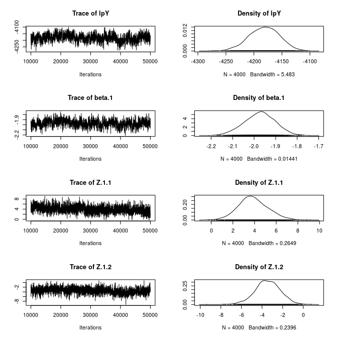

```{r setup, include=FALSE}
knitr::opts_chunk$set(echo = TRUE)
suppressPackageStartupMessages(library(latentnet))
suppressPackageStartupMessages(library(network))
suppressPackageStartupMessages(library(statnet))
suppressPackageStartupMessages(library(tidyverse))
library(coda)
library(latentnet)
library(network)
library(tidyverse)
library(GGally)
library(sna)
library(statnet)
'%out%' <- Negate ('%in%')
load("g_enron.Rda")
```

## Social network analysis

### The nature of social networks

Following the reduction of the corpus, the remaining senders and receivers were natural persons who engaged in mutual correspondence. These constitute `nodes` or `vertices` and their emails `edges`^[Or `arcs`, when directionality is considered]. Draw theee points and connect them, and you have created three nodes and three edges, a triagle, which is termed a `graph` object. A graph object encapsulates many useful features aside from who knows whom^[Such as the parlor game [six degrees of Kevin Bacon]] including measures of density, centrality, connectedness, separation, clustering and other indicia of how well or poorly embedded in an organization any individual may stand.

A graph object has the added advantage that its `edges` (connectors) can be loaded with an arbitrary number of attributes, such as date and semantic analysis content. For example a graph may be partitioned by topics -- some correspondents may have a purely non-business social relationship, others may be concerned solely with facilities maintenance, and yet others may have a strong association with trading commodities.

Graphs are potentially computationally intensive, which motivated the reduction of the selection of emails and users to approximately 1.4% of the emails available for examination.^[Together with the observation of the many sources of noise arising from the high volume of emails not relevant to any of the inquiries being made, including, for example, inspirational quotes of the day from an external site.]

Graphs are not only a processing unit, they constitute the domain of their own branch of mathematics.^[*See, e.g.*, the brief tutorial by [Keijo Ruohonen]].

### Exploratory data analysis of the Enron social network.

#### Visualization

```{r p_raw, echo=FALSE}
netmat_raw <- g_enron %>% select(t_userid, f_userid)
net_raw <- network(netmat_raw, matrix.type = "edgelist")
net_p_raw <- plot(net_raw, vertex.cex = 0.1)
```

The graph shows a dense cluster of users with a high concentration of potentially connected gropus of mutually interacting pairs surrounded by a cloud of low interactivity.

#### Size

```{r net_raw}
net_raw
raw_edges <-  length(net_raw$mel)
raw_vertices <- net_raw$gal$n

```

The graph consists of `r` raw_edges` edges, each representing one or more emails, an average of `r raw_edges/raw_vertices` emails per user.

#### Density

```{r, echo=FALSE}
raw_density <- gden(net_raw)
```

The graph has a density of `r raw_density`, which is very low.

#### Components

```{r connectedness, echo=FALSE, results='hide'}
cd_weak    <- component.dist(net_raw ,connected = "weak")
net_raw_weak   <- length(cd_weak$csize)
cd_strong  <- component.dist(net_raw ,connected = "strong")
net_raw_strong <- length(cd_strong$csize)
```

As seen in the visualization of the graph, two components are present, one that is strongly connected, and the other, weakly, comprising `r net_raw_strong` and `r net_raw_weak` members, respectively.

#### Diameter

```{r diameter, echo=FALSE, results='hide'}
lgc <- component.largest(net_raw, result = "graph")
gd <- geodist(lgc)
```

The diameter of the graph, `r max(gd$gdist)`, is the number of steps required to connect the two nodes furthest apart.

#### Clustering

```{r clustering, echo=FALSE, results='hide', warning=FALSE}
clus <- gtrans(net_raw, mode = "graph", use.adjacency = FALSE)
```

The clustering coefficient of the graph is low, `r clus`, indicating relatively few users who belong to interacting groups.

### Description of the reduced Enron graph

```{r extract, echo=FALSE, results='hide'}
net <- delete.vertices(net_raw, isolates(net_raw))
net_vertices <- net$gal$n
net
```

Eliminating isolates reduces the number of connection endpoints from `r length(net_raw$mel)` to `r net_vertices`. Within the original graph, the number of isolated node pairs, those that do not connect to the dense cluster in the center, can be eliminated to show the most interactive exchanges, thusly

    net <- delete.vertices(net_raw, isolates(net_raw))


#### Visualization

The contrast between the original and reduced graph (after removing isolates) is visually striking. Note that the edge line *length* does have any meaning; they vary solely to promote better visual discrimination.

```{r p, echo=FALSE}

gplot(net, usearrows = FALSE, edge.col = "gray80", lwd = 0.5)

```

The reduced graph is the dense portion of the original, but some more readily discernable structure is apparent. 

#### Density

The graph has a density of `r gden(net)`,  compared to the original graph, `r raw_density` or `r gden(net)/raw_density` greater.

#### Components

```{r connectedness_1, echo=FALSE, results='hide'}
cd_weak    <- component.dist(net ,connected = "weak")
net_weak   <- length(cd_weak$csize)
cd_strong  <- component.dist(net ,connected = "strong")
net_strong <- length(cd_strong$csize)
```

As seen in the visualization of the graph, only `r net_weak` member is weakly connected.

#### Diameter

```{r diameter_1, echo=FALSE, results='hide'}
lgc <- component.largest(net, result = "graph")
gd <- geodist(lgc)
```

The diameter of the graph, `r max(gd$gdist)`, the number of steps required to connect the two nodes furthest apart, is unchanged from the original.

#### Clustering

```{r clustering_1, echo=FALSE, results='hide', warning=FALSE}
clus <- gtrans(net, mode = "graph", use.adjacency = FALSE)
```

The clustering coefficient of the graph is low, `r clus`, essentially identical to the original graph, indicating relatively few users who belong to interacting groups.

### Decomposition of the reduced Enron graph

Among the nodes represented in the visualization above, some have satellite nodes that connect principally to these center points. As a reminder, the length of the edge lines carries no meaning, nor the distance or proximity between dense portions of the graph. The rendering algorithm's principal purpose is to spread out the links to promote visual clarity.

Although, visual inspection shows some *remote* nodes, every node is directly or indirectly connected to every other node in the graph, the number of isoletes is `r isolates(net)`. However, visual inspection also shows that *some* nodes are much more connected than others.

To identify these, measures of **centrality**. Three of those are `degree`, which measures aspects of the prominence of a node (user) in the network based on how many or few intermediates are required to reach any other node. The metric `betweenedness` representes how many connections between other nodes must pass through it to indirectly connect to nodes to which they are not directly connected. The third measure `infocent` measures the directness of a node to other nodes. Other measures of centrality exist, but the scope of this paper excludes a comparison among them.

Instead, the three were measured for each node in the reduced graph, giving them equal weight. The top 10% of nodes with high `degree` scores were selected, followed among those by the top 10% of high `betweenedness` scores, then high `infocent` scores to create a composite centrality indicator. Subsequent adjustments may improve the efficacy of the machine learning approach in this paper.

```{r centrality}
load("prominence.Rda")
prominence %>% select(deg, btw, inf) %>% cor()
prominence
```

The three measures of prominence are correlated, to varying degrees, indicating that they are measuring the characteristic of centrality non-independently. Just `r nrow(prominence)` nodes are in the top 10% of centrality. 

```{r prominence}
load("centrals.Rda")
net_p <- network(prominence, matrix.type = "edgelist")
vertices <- network.vertex.names(net_p)
prominent <- g_enron %>% filter(f_userid %in% centrals | t_userid %in% centrals)
```

These `r length(net_p$mel)` users are connected to `r length(vertices) - length(net_p$mel)` other users. They account for `r nrow(prominent)/nrow(g_enron)*100`% of the emails, as sender or receiver, in the reduced graph. Limiting the reduced graph to these central users results in the following graph.

```{r}
load("prominent.Rda")
netmat <- prominent %>% select(t_userid, f_userid)
net_p <- network(netmat, matrix.type = "edgelist")
vertices <- network.vertex.names(net_p)
ggnet(net_p, size = 0.1, alpha = 0.84)
```

This visualization, like original graph, shows "noise" in the form of a cloud of poorly connected node pairs surrounding a denser inner core, even after senders and receivers were restricted to the most prominent users. 

```{r}
net_p
vertices_before <- length(network.vertex.names(net_p))
```


```{r} 
delete.vertices(net_p, isolates(net_p))
vertices_after <- length(network.vertex.names(net_p))
ggnet(net_p, size = 0.1, alpha = 0.84)

```

Removing those outliers brings the core network into sharper relief by reducing the number of vertices, from `r vertices_before` to `r vertices_after`.


### Machine learning decomposition of the core network

Although the network has been reduced by inspection, the visualization of the result is ambiguous as to clusters of similar senders/recievers (nodes/edges). To validate the results, a machine learning tool is indicated.  The [latentnet] package was selected for that task. An [accessible] description of that package, as well as a more [theoretical] paper are available for orientation. 

The package applies exponential random graph modeling to the vertices, edges and optionally their attrtibutes to recursively dervive graph characteristics that are impractical to extract otherwise, due to the interdependence of graph measures. 

#### Model creation

The first step is to fit a model to a network object:

      net_p.fit <- ergmm(net_p ~ euclidean(d=2, G=3), verbose = TRUE) # up to 30 minutes for 250 nodes
      Generating initial values for MCMC:
      Computing geodesic distances... Finished.
      Computing MDS locations... Finished.
      Computing other initial values... Finished.
      Finding the conditional posterior mode... Finished.
      Burning in... Finished.
      Starting sampling run... Finished.
      Post-processing the MCMC output:
      Performing label-switching... Finished.
      Fitting the MKL locations... Finished.
      Fitting MBC conditional on MKL locations... Finished.

The arguments to `ergmm` specify a negative Euclidian distance in 2-space for a three cluster grouping. The algorithm performs a Markov chain Monte Carlo simulation, the  absolute row/column differences within the adjacency matrix to fit the Minimum Kullback-Liebler divergence statistic to produce model based clustering of the vertices in the graph.

```{r}
library(latentnet)
library(coda)
load("net_p.fit.Rda")
summary(net_p.fit)
```




#### Model Diagnostics

Graphs do not uniformly converge under the `ergmm` function call. To test this, a diagnostic is available to detect failure of the Markov chain Monte Carlo simulation to converge and to detect autocorrelation effects. One section provides an initial and lag 10 covariance matrix of the sampling. 

```{r}
load("net_p.fit.Rda")
mcmc.diagnostics(net_p.fit, which.diags = c("cor", "acf", "rafferty"))
```

#### Goodness of fit


```{r}
net_p.gof <- gof(net_p.fit)
net_p.gof
par(mfrow=c(1,3))
par(oma=c(0.5,2,1,0.5))
plot(net_p.gof, plotlogodds=TRUE)
```

#### Visualization of model clusters, position within sample space and density

```{r}
plot(net_p.fit, pie=TRUE)
plot(net_p.fit, what="cloud", rand.eff="receiver", Z.ref=Z.ref, Z.K.ref=Z.K.ref)
plot(net_p.fit, what="density", rand.eff="receiver", Z.ref=Z.ref, Z.K.ref=Z.K.ref)
```

Using the cluster assignment to sender and recipient userids confirms the graph:

```{r}
load("n_enron.Rda")
n_enron %>% group_by(f_cluster, t_cluster) %>% count() %>% arrange(desc(n))
```

Members of cluster 1 correspond predominantly to other members of cluster 1 and to a substantial number of cluster 2 members. There is only one message from a cluster 1 member to a cluster 3 member. Cluster 2 members have an even division of emails sent to or received from cluster 1 and a smaller cluster 2 to cluster 2 correspondence. Correspondence between clusters 2 and 3, in either direction, is much less.

#### Application of the deconstruction of the Enron network

Through a combination of analytic judgment and machine learning a three-cluster partition of the emails has been created. The obvious question to now be addressed is what those clusters represent in terms of email content. For that the tools of natural language processing will be applied.

