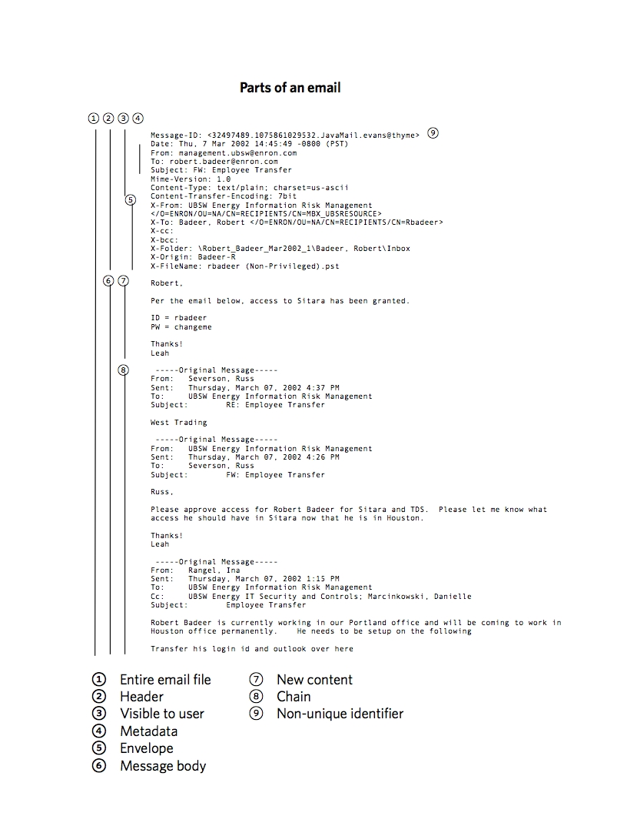

```{r setup, echo=FALSE, warning=FALSE, output="asis", message=FALSE}

# silently load libraries

suppressPackageStartupMessages(library(coda))
suppressPackageStartupMessages(library(GGally))
suppressPackageStartupMessages(library(ggnetwork))
suppressPackageStartupMessages(library(ggthemes))
suppressPackageStartupMessages(library(here))
suppressPackageStartupMessages(library(hrbrthemes))
suppressPackageStartupMessages(library(latentnet))
suppressPackageStartupMessages(library(network))
suppressPackageStartupMessages(library(sna))
suppressPackageStartupMessages(library(statnet))
suppressPackageStartupMessages(library(statnet.common))
suppressPackageStartupMessages(library(tidyverse))

# make reproducible

set.seed(2203)

# functions

# verb to exclude items from another list

'%out%' <- Negate ('%in%')

# format digits to zero places

comma0 <- function(x) format(x, digits = 0, big.mark = ",")

# format digits to two places

comma2 <- function(x) format(x, digits = 2, big.mark = ",")

# create network package graph object 

netr <- function(x) {
	net <- network(x, matrix.type = "edgelist")
}

# remove isolates: remove disconnected users 

neti <- function(x) {
  delete.vertices(x, isolates(x))
}

# symmetrize: limit to two-way users

# nets <- function(x) {
#   x <- symmetrize(x , rule = "strong", return.as.edgelist=TRUE)
#   x <- network(x, matrix.type = "edgelist")
# }

# number of vertices in a network object

census <- function(x) {
  length(network.vertex.names(x))
}

# vertices names in a network object

cohort <- function(x) {
  network.vertex.names(x)
}

# plot with all vertix labels

node_plot <- function(x){
  ggnet2(x, label = TRUE, label.size = 2, node.color = "white",     edge.size = 0.25, edge.color = "grey")
}

# x is a network object, y is the date interval string

plot_graph <- function(x,y) {
ggplot(x, aes(x, y, xend = xend, yend = yend)) +
geom_edges(size = 0.25, color = "gray")               +
geom_nodes(size = 0.75, color = "steelblue")          +    
  labs(title="Graph of reduced Enron corpus",
       subtitle= y,		  
       caption="Source: Richard Careaga")			  + 
theme_ipsum_rc()									  +
theme_void()
}

# prepare tibble for time series plot 

# x is Qxxx_raw
Q_ts <- function(x) {
	x %>% group_by(date) %>% count()
}

# create a time series plot

# x is Qxxx_ts, a tibble object, y is the date interval character
plot_ts <- function(x,y) {
verti

# Get x-y coordinates for selective plotting of userid
# x is a network object

get_xy <- function(x) {
  ggnetwork(x)
}


# email recipient cleanser patterns 
faux_nl   	<-	"\\\n"
left_brak	  <-	"\\["
right_brak	<-	"\\]"
quote_s     <-  "'"

node

 
# remove supurious characters from recipients field, 'tos'

g_enron <- enron 								                		  %>%
	mutate(tos = str_replace_all(tos, faux_nl, ""))		  %>%
	mutate(tos = str_replace_all(tos, left_brak, "")) 	%>%
	mutate(tos = str_replace_all(tos, right_brak, ""))	%>%
	mutate(tos = str_replace_all(tos, quote_s, ""))
	
#
# # restrict to single recipient
#
# g_enron <- g_enron %>% filter(tosctn == 1 & ccsctn == 0)
#
# # censor non-enron addresses and reduce fields
#
g_enron <- g_enron                        %>%
  filter(str_detect(tos, "enron.com"))    %>%
  filter(str_detect(sender, "enron.com")) %>%
  select(sender, tos, date, lastword)     %>%
  rename(recipient = tos, payload = lastword)
#
# # remove @enron.com from user names and single quotes
#
# g_enron  <- g_enron                                           %>%
#   mutate(sender = str_replace_all(sender, ".enron.com", ""))  %>%
#   mutate(recipient = str_replace_all(recipient,
#                                      ".enron.com.", ""))      %>%
#   mutate(recipient = str_replace_all(recipient, "'", ""))
#
# # censor internal group addresses
#
# excluded_users <- c("all-hou.dl-bus", "all.america", "all.employees", "center.dl_portland", "chick.home", "clickathome", "clickathomepilot3", "dl-ga-all-ews", "dl-ga-all_enron_worldwide ", "dl-ga-all_enron_worldwide1", "dl-ga_all_enron_worldwide2", "dl-gal-all_enron_north_america2", "enron.chairman", "enron.gss", "executive.committee", "expense.report", "group.dl-ets", "helpdesk.mailman", "info", "outlook.team", "perfmgmt", "perfmgmt@ect", "portland", "portland.desk", "portland.shift", "sap_security", "the.globalist", "traders.eol", "trading .williams", "transportation.parking", "undisclosed-recipients")
#
# g_enron <- g_enron %>% filter(sender %out% excluded_users)
# g_enron <- g_enron %>% filter(recipient %out% excluded_users)
#
# # add record identification
#
# g_enron <- rownames_to_column(g_enron, var = "recno")
#
# collect unique user names

sender    <- g_enron %>% select(sender)     %>% distinct()
recipient <- g_enron %>% select(recipient)  %>% distinct()
colnames(sender)    <- "user"
colnames(recipient) <- "user"
users <- bind_rows(sender,recipient)
users <- users %>% distinct()
#
# assign numeric identifiers to users

set.seed(2203)
user_pool <- seq(1000,nrow(users)+1001,1)
userid <- enframe(sample(user_pool, nrow(users),
          replace = FALSE))                     %>%
          select(-name)                         %>%
          rename(userid = value)                %>%
          mutate(userid = as.integer(userid))
userid <- bind_cols(users, userid)

#save(userid, file = "userid.Rda")
#
# rename userid columns to join to g_enron as sender s_uid

colnames(userid) <- c("sender", "s_uid")
g_enron <- left_join(g_enron, userid)

# again for recipient r_uid

colnames(userid) <- c("recipient", "r_uid")
g_enron <- left_join(g_enron, userid)

# replace r_uid with userid

userid <- userid %>% rename(userid = r_uid)

# for inter-session convenience
#save(g_enron, file = "g_enron.Rda")

# # remove unneed objects from namespace
#
# rm(enron, faux_nl, left_brak, right_brak, user_pool, users, userid)

# divide into quarters and create file for all quarters
# including only symmetrical pairs sender -> recipient
# and recipient-sender messages in same period
# Naming convention: Q300 is Quarter 1 of 2000

# For convenience to avoid running commented block above

load("g_enron.Rda")
load("userid.Rda")  # reload originally assigned userids

# For the entire 23-month period and each quarter create objects

# tibble for time series

Qall_raw <- g_enron 									%>% 
	filter(date > "1999-12-31")					%>% 
	select(date, s_uid, r_uid)

# network object including all vertices

Qall_sparse <- Qall_raw 							%>% 
	select(-date) 										  %>% 
	netr(.) 

# network object eliminating isolates and non-reciprocal users

Qall <- Qall_raw        %>% 
        select(-date)   %>%
        netr(.)         %>% 
        nets(.)         %>% 
        neti(.)

# Get x-y coordinates for selective plotting of userid
# x is a network object

get_xy <- function(x) {
  ggnetwork(x)
}

  
# Userids remaining in network

all_users <- network.vertex.names(Qall)

# create time series chart object
Qall_ts <- Q_ts(Qall_raw)

#Q399 3 vertices, omitted
#Q499 3 vertices, omitted

# same process for quarters; naming convention
# Q100 = quarter 1 of 2000

Q100_raw <- g_enron 									                %>% 
	filter (date >= "2000-12-31" & date < "2001-04-01") %>% 
	select(date, s_uid, r_uid)

Q100_sparse <- Q100_raw 							%>% 
	select(s_uid, r_uid) 								%>% 
	netr(.)

Q100 <- Q100_sparse 									%>% 
	nets(.) 											      %>% 
	neti(.)

Q100_ts <- Q_ts(Q100_raw)

Q200_raw <- g_enron 									                %>% 
	filter (date >= "2000-04-01" & date < "2000-07-01") %>% 
	select(date, s_uid, r_uid)

Q200_sparse <- Q200_raw 							%>%
	select(s_uid, r_uid) 								%>%
	netr(.) 

Q200 <- Q200_sparse 									%>% 
	nets(.) 											      %>% 
	neti(.)

Q200_ts <- Q_ts(Q200_raw)

Q300_raw <- g_enron 									                %>% 
	filter (date >= "2000-07-01" & date < "2000-10-01") %>% 
	select(date, s_uid, r_uid)

Q300_sparse <- Q300_raw 								%>%
	select(s_uid, r_uid)								  %>%
	netr(.)

Q300 <- Q300_sparse 									  %>% 
	nets(.)											        %>%
	neti(.)

Q300_ts <- Q_ts(Q300_raw)

Q400_raw <- g_enron 									                %>% 
	filter (date >= "2000-10-01" & date < "2001-01-01") %>% 
	select(date, s_uid, r_uid)

Q400_sparse <- Q400_raw 								%>% 
	select(s_uid, r_uid) 								  %>%
	netr(.)

Q400 <- Q400_sparse										  %>% 
	nets(.)												        %>% 
	neti(.)

Q400_ts <- Q_ts(Q400_raw)

Q101_raw <- g_enron 									                %>% 
	filter (date >= "2001-01-01" & date < "2001-04-01") %>% 
	select(date, s_uid, r_uid)

Q101_sparse <- Q101_raw 								%>%
	select(s_uid, r_uid) 								  %>%
	netr(.) 

Q101 <- Q101_sparse										  %>%
	nets(.) 											        %>%
	neti(.)

Q101_ts <- Q_ts(Q101_raw)

Q201_raw <- g_enron 									                %>% 
	filter (date >= "2001-04-01" & date < "2001-07-01") %>% 
	select(date, s_uid, r_uid)

Q201_sparse <- Q201_raw 								%>% 
	select(s_uid, r_uid) 								  %>%
	netr(.)

Q201 <- Q201_sparse 									  %>% 
	nets(.) 											        %>%
	neti(.)

Q201_ts <- Q_ts(Q201_raw)

Q301_raw <- g_enron 									                %>% 
	filter (date >= "2001-07-01" & date < "2001-10-01") %>% 
	select(date, s_uid, r_uid)

Q301_sparse <- Q301_raw 								%>% 
	select(s_uid, r_uid) 								  %>% 
	netr(.)

Q301 <- Q301_sparse 										%>% 
	nets(.) 											        %>%
	neti(.)

Q301_ts <- Q_ts(Q301_raw)

Q401_raw <- g_enron										                %>% 
	filter (date >= "2001-10-01" & date < "2002-01-01") %>%
	select(date, s_uid, r_uid)

Q401_sparse <- Q401_raw 								%>% 
	select(s_uid, r_uid) 								  %>%
	netr(.) 

Q401 <- Q401_sparse 									  %>%
	nets(.) 											        %>% 
	neti(.)

Q401_ts <- Q_ts(Q401_raw)

# Quarterly census of users

Q100_c <- cohort(Q100)
Q200_c <- cohort(Q200)
Q300_c <- cohort(Q300)
Q400_c <- cohort(Q400)
Q101_c <- cohort(Q101)
Q201_c <- cohort(Q201)
Q301_c <- cohort(Q301)
Q401_c <- cohort(Q401)

# Users in all quarters

All_qtrs <- Reduce(intersect,  list(Q100_c,Q200_c,Q300_c,Q400_c,Q101_c,Q201_c,Q301_c,Q401_c))

# Email pairs in all quarters

msg_count <- g_enron                                  %>% 
  filter(s_uid %in% all_users & r_uid %in% all_users) %>%     
  group_by(s_uid, r_uid)                              %>% 
  count()                                             %>%
  ungroup()                                           %>%
  arrange(desc(n))

# Email senders in all quarters

s_uid_count <- g_enron                                %>% 
  filter(s_uid %in% all_users)                        %>%     
  group_by(s_uid)                                     %>% 
  count()                                             %>%
  ungroup()                                           %>%
  arrange(desc(n))

send_q1 <- annotate("text", x = 0.5, y = 75, label = "Single digits")
send_q2 <- annotate("text", x = 1.5, y = 75, label = "Double  digits")
send_q3 <- annotate("text", x = 2.5, y = 75, label = "Triple digits")

send_p <- ggplot(s_uid_count, aes(log10(n)))		+ 
	geom_bar() 										                + 
	coord_flip() 									                +
	xlab("Emails sent. log10") 						        +
	ylab("Number of users")		 					          +
	send_q1    										                +
	send_q2     	 								                +
	send_q3 	     								                +
	labs(title = "Number of emails sent per user",
        subtitle = "January 2000-November 2001",		  
        caption = "Source: Richard Careaga")		#+ 
	#theme_ipsum_rc()				

# Email recipients in all quarters

r_uid_count <- g_enron                                %>% 
  filter(r_uid %in% all_users)                        %>%     
  group_by(r_uid)                                     %>% 
  count()                                             %>%
  ungroup()                                           %>%
  arrange(desc(n))

# recd_p <- ggplot(r_uid_count, aes(log10(n)))		+ 
# 	geom_bar() 										+ 
# 	coord_flip() 									+
# 	xlab("Emails (log10) received") 				+
# 	ylab("Number of users")		 					+
# 	send_q1    										+
# 	send_q2     	 								+
# 	send_q3 	     								+
# 	labs(title = "Emails received per user",
#         subtitle = "January 2000-November 2001",		  
#         caption = "Source: Richard Careaga")		#+ 
#     #theme_ipsum_rc()


```


# Introduction

## Goal

The goal of this paper is to illustrate a combination of latent network detection and latent topic modeling machine learning, applied to corporate email to test whether the two classify email users similarly.

# Background

> In times of political turmoil, events can move from impossible to inevitable without even passing through improbable. [Anatole Kalesky]

[Enron Corp.] and its affiliates were engaged in energy-related businesses, as described in its [Annual Report on Form 10-K for the year ended December 31, 2000].

    *    the transportation of natural gas through pipelines to
    markets throughout the United States;
    
    *    the generation, transmission and distribution of
    electricity to markets in the northwestern United States;
    
    *    the marketing of natural gas, electricity and other
    commodities and related risk management and finance services
    worldwide;
    
    *    the development, construction and operation of power
    plants, pipelines and other energy related assets worldwide;
    
    *    the delivery and management of energy commodities and
    capabilities to end-use retail customers in the industrial
    and commercial business sectors; and
    
    *    the development of an intelligent network platform to
    provide bandwidth management services and the delivery of
    high bandwidth communication applications.

As of December 31, 2000, Enron employed approximately
20,600 persons.

For the year ended December 31, 2000, it had operating revenues of $100,789 million, according to the same report, in which it described one of its businesses as

> Enron purchases, markets and delivers natural gas, electricity and other commodities in North America. Customers include independent oil and gas producers, energy- intensive industrials, public and investor-owned utility power companies, small independent power producers and local distribution companies. Enron also offers a broad range of price, risk management and financing services including forward contracts, swap agreements and other contractual commitments. Enron's strategy is to enhance the scale, scope, flexibility and speed of its North American energy businesses through developing and acquiring selective assets, securing contractual access to third party assets, forming alliances with customers and utilizing technology such as EnronOnline.  With increased liquidity in the marketplace and the success of EnronOnline, Enron believes that it no longer needs to own the same level of physical assets, instead utilizing contracting and market-making activities.

On December 2, 2001, Enron filed for [bankruptcy protection].

In less than a year, Enron underwent a complete reversal of fortune as its business strategies ran afoul of applicable regulations, among which were those of the Federal Energy Regulatory Commission (**FERC**).

FERC [became aware] of irregularities in the California wholesale electricity market prices, a business in which Enron participated. An orientation to the issues is provided by [testimony] before FERC, which  provides a concise summary.^[The short version, which I can relate as a former California electric utility regulatory official from personal knowledge, is that public electric utilities were losing a large share of industrial customers to self-generation. Many businesses found it cheaper to generate on-site than to pay tariff rates. Foreseeably, residential and business customers without the option to self-generate would come to  bear the entire cost of unamortized utility fixed assets (termed *stranded costs*), and rates for retail, commercial and small industrial customers would increase. The adopted solution was to require the utilities to sell their generation plants and buy power on a new public market on a *day-ahead*, tomorrow's estimated demand, and an *hour-ahead* basis for unanticipated demand. Although much thought was devoted to the dangers that participants would game the system to sell at premiums or buy at discounts from market, insufficient consideration was given to multi-participant cooperation.]

Following Enron's bankruptcy, FERC began an intense investigation, including the email records of 149 Enron employees. A preliminary [staff report] issued six months later.

## Motivating Data

FERC obtained approximately 500,000 emails. Copies of these were acquired by Leslie Kaelbling of MIT and [published] by William W. Cohen of Carnegie Mellon University. It is one of the largest publicly available datasets of corporate email and is referred to as the Enron Corpus. The term *corpus* is used in natural language processing to denote a collection of related text.

At the time, electronic record examination (*ediscovery*) in litigation was in a primitive state. It was not uncommon, for example, for paper copies of email to be offered. These would typically be read by teams of freelance attorneys looking for keywords. Advanced technology included scanning with optical character recognition and some proprietary software options to organize emails and capture the status of review. 

Much of the focus was directed to keyword searches, sometimes called the *smoking gun* approach. Brute force examination misses opportunities to understand the social networks that reflect how the organization operates, what their concerns are and the haphazard exposure of document reviewers inevitably poses the [Elephant and the Blind Men Problem]. To triage the corpus quickly and efficiently, it should first be distilled and analyzed in terms of its network characteristics -- who corresponds privately with whom.

# Analysis

## Data acquisition

I obtained a copy of the [2009 version] of the corpus. It contains copies of emails of a private nature that involve three users have who since requested to be [redacted]. I have removed those 27 emails.^[Most of my work on data wrangling and preliminary analysis took place in 2010 in Python, relying heavily on the NLTK and networkx packages.]

The following were extracted from the SQL database I prepared for my 2010 analysis on the graph portion of this paper.

\begin{verbatim}

    +----------+--------------+------+-----+---------+-------+
    | body     | mediumtext   | YES  |     | NULL    |       |
    | lastword | mediumtext   | YES  |     | NULL    |       |
    | hash     | varchar(250) | YES  | UNI | NULL    |       |
    | sender   | varchar(250) | YES  |     | NULL    |       |
    | tos      | text         | YES  |     | NULL    |       |
    | mid      | varchar(250) | YES  |     | NULL    |       |
    | ccs      | text         | YES  |     | NULL    |       |
    | date     | datetime     | YES  |     | NULL    |       |
    | subj     | varchar(500) | YES  |     | NULL    |       |
    | tosctn   | mediumint(9) | YES  |     | NULL    |       |
    | ccsctn   | mediumint(9) | YES  |     | NULL    |       |
    | source   | varchar(250) | YES  |     | NULL    |       |
    +----------+--------------+------+-----+---------+-------+
\end{verbatim}

The principal fields used in this paper are:

* sender
* date
* subject
* recipient
* lastword (content in the email that does not occur in its related thread, if any)

### Conversion

Each email was a plaintext file^[Most had been generated by Microsoft Outlook, but some older emails were produced in IBM Notes, which created some character encoding issues.] Each user had a directory tree similar to the one below.^[This user had 10 directories with 3048 files (the directory tree illustration has been pruned to omit spurious detail) containing 12,147 lines and 69,226 words.]


Although tedious, traversing the directory tree, parsing the emails and loading them into an SQL database, was accomplished with a combination of Python and Perl scripting and standard bash tools. I do not reproduce that process here as it has little bearing on the main topic of this paper.^[For this paper, supplemental processing of the recipient field was necessary and reflected in the script to remove spurious punctation, such as the newline character embedded as slash-n.]

### Data structure

While the emails were not in native format, the plain text versions contained nine principal segments, as shown in the figure below



### Deduplication

Using scripting tools, each text file extraction created a *payload* of the new content in the related email, capturing the text between the beginning metadata and the following metadata for email purposes. A `payload` hash, an [md5] encoded message digest^[In theory, it is possible that two non-identical sequences of bytes be encoded identically; the probability is low enough to make an md5 digest usable as a checksum verification, its purpose here.] was used in the initial analysis as a primary key to assure the uniqueness of each record. Approximately half of the corpus consisted of duplicates, such as the original message in the sender's sent file and one or more copies in the recipient's inbox, at a minimum. Multiple recipients and recipients who used email folders as a filing system were another source of duplicate messages. Applying this filter reduced the corpus to approximately 250,000 emails.

### Text isolation

For natural language processing (**NLP**) purposes, treating the `payload` rather than the `message body` as the unit of analysis avoided an *echo chamber* effect of `chains` quoting and re-quoting the original message, multiplying the frequency of the words it contained.

### Prioritization

Traditional analysis of emails was conducted on the principle that *something may be overlooked,* which delays the value of email in preliminary analysis. Prioritizing always leaves open the option of reviewing the set-asides later.

After deduplication, the first filter applied was to eliminate all email from external addresses that were not also recipients from internal addresses. Spam, newsletters and the like have low information potential. This filter reduced the remaining half of the corpus by half again, leaving approximately 125,000 emails.

A second filter for internal email was used to eliminate broadcast messages and high frequency administrative messages. Indicia of broadcast messages were large numbers of recipients, high frequency, paucity of return correspondence and keyword in context screening. Administrative messages to single recipients were identified by frequency, lack of return correspondence and high frequency words. Many of these were nagging emails concerning the lack of approval of expense reports, for example. This filter reduced the dataset to approximately 24,000.

The third filter limited the dataset to emails sent before Enron's December 2, 2001 bankruptcy. This filter reduced the email count to approximately 13,500, about 2.7% of the original total. A few emails dated "1979-12-31" were reviewed and deleted. The resulting dataset was named `g_enron` for its initial purpose, network graph analysis.

## Social network analysis

### The nature of social networks

Following the reduction of the corpus, the remaining senders and receivers were natural persons who engaged in mutual correspondence. These constitute `nodes` or `vertices` and their emails `edges`^[Or `arcs`, when directionality is considered]. Draw theee points and connect them, and you have created three nodes and three edges, a triagle, which is termed a `graph` object. A graph object encapsulates many useful features aside from who knows whom^[Such as the parlor game [six degrees of Kevin Bacon]] including measures of density, centrality, connectedness, separation, clustering and other indicia of how well or poorly embedded in an organization any individual may stand.

A graph object has the added advantage that its `edges` (connectors) can be loaded with an arbitrary number of attributes, such as date and semantic analysis content. For example a graph may be partitioned by topics -- some correspondents may have a purely non-business social relationship, others may be concerned solely with facilities maintenance, and yet others may have a strong association with trading commodities.

Graphs are potentially computationally intensive, which motivated the reduction of the selection of emails and users to approximately 1.4% of the emails available for examination.^[Together with the observation of the many sources of noise arising from the high volume of emails not relevant to any of the inquiries being made, including, for example, inspirational quotes of the day from an external site.]

Graphs are not only a processing unit, they constitute the domain of their own branch of mathematics.^[*See, e.g.*, the brief tutorial by [Keijo Ruohonen]].

### Augmentation and transformation

Each unique Enron address in the reduced dataset was assigned a userid. The primary purpose was to facilitate social network analysis with node identifiers of uniform length; the second, to reduce analyst bias arising from gender stereotyping, frequency of exposure and similar subjective pattern seeking behaviors. 

To achieve a computationally practicable dataset for initial social network analysis, emails were limited to single Enron sender to Enron single recipient, reducing the dataset further, to 9,615 emails.

```{r, echo=FALSE, results="as-is", comment=NA, message=FALSE,  error = FALSE,  warning=FALSE}
plot_graph(Qall_sparse, "January 2000-December 2001")
```

The resulting graph had low density, and the the dataset was further trimmed by restricting it to non-isolate, reciprocal correspondents, each of whom sent an email to the other, either as a reply or an original message, excluding emails by a user to herself.

```{r, echo=FALSE, results="as-is", comment=NA, message=FALSE,  error = FALSE,  warning=FALSE}
plot_graph(Qall, "January 2000-December 2001")
```

## The network composition

The reduced Enron social network is defined to consist of those emails in the corpus consisting of one enron.com sender to one Enron.com recipient (excluding apparently automated accounts) if the recipient either replies to the sender or initiates a contact with the sender.

### Time frame

All emails from January 1, 2000 to December 2, 2001 the date of the [bankruptcy] were collected. A handful of messages prior to January 1, 2000 were excluded due to their small quarterly count.

### Users

A total of `r comma2(nrow(userid))` unique users are represented. However, all but `r census(Qall)` users are non-reciprocating or isolated. To identify those, the sender and recipient userids were extracted and converted to a graph object, which will be referred to as the **reduced Enron corpus.** Following are the characteristics of the 23-month series. The attributes are 

* vertices: users
* directed: from-to and to-from distinguished
* hyper: contains emails from or to multiple users
* loops: includes email from user to herself
* multiple: multi-dimensional object
* bipartite: set of two vertices where no vertex in the same set is connected
* edges: number of emails

```{r, echo=FALSE, results="as-is", comment=NA, message=FALSE,  error = FALSE,  warning=FALSE}
Qall
```

Graph objects shown here represent users (vertices) by dots and emails (edges) by lines. The length of the line is not a measure of distance. The visualization algorithm arranges vertices and edges to promote recognition of connections only. It is also important to note that the visual representation of graph objects is not stable. The identical graph and identical algorithm will produce visual representations that portray the same graph object in different orientatinos. The relationships are preserved, but the Cartesian geometery is not.

### Time series of reduced Enron corpus January 2000-December 2001

One outlier and several groups of outliers are apparent, mid-May 2001 and the weeks leading up to the [bankruptcy].


```{r, echo = FALSE, warning=FALSE, message=FALSE}
plot_ts(Qall_ts, "January 2000-December 2001")
```

### Volume sent and received January 2000-December 2001

```{r, echo=FALSE, results="as-is", comment=NA, message=FALSE,  error = FALSE,  warning=FALSE}
send_p
```


```{r, echo=FALSE, results="as-is", comment=NA, message=FALSE,  error = FALSE,  warning=FALSE}
recd_p
```

### Quarterly breakdown of reduced Enron corpus

#### First quarter 2000

```{r, echo=FALSE, results="as-is", comment=NA, message=FALSE,  error = FALSE,  warning=FALSE}
Q100
plot_graph(Q100, "January-March 2000")
```

```{r, echo = FALSE, warning=FALSE, message=FALSE}
plot_ts(Q100_ts, "January-March 2000")
```

#### Second quarter 2000

```{r, echo=FALSE, results="as-is", comment=NA, message=FALSE,  error = FALSE,  warning=FALSE}
Q200
plot_graph(Q200, "April-June 2000")
```

```{r, echo = FALSE, warning=FALSE, message=FALSE}
plot_ts(Q200_ts, "April-June 2000")
```

#### Third quarter 2000

```{r, echo=FALSE, results="as-is", comment=NA, message=FALSE,  error = FALSE,  warning=FALSE}
Q300
plot_graph(Q300, "July-September 2000")
```

```{r, echo = FALSE, warning=FALSE, message=FALSE}
plot_ts(Q300_ts, "July-September 2000")
```

#### Fourth quarter 2000

```{r, echo=FALSE, results="as-is", comment=NA, message=FALSE,  error = FALSE,  warning=FALSE}
Q400
plot_graph(Q400, "October-December 2000")
```

```{r, echo = FALSE, warning=FALSE, message=FALSE}
plot_ts(Q400_ts, "October-December 2000")
```

#### First quarter 2001

```{r, echo=FALSE, results="as-is", comment=NA, message=FALSE,  error = FALSE,  warning=FALSE}
Q101
plot_graph(Q101, "January-March 2001")
```

```{r, echo = FALSE, warning=FALSE, message=FALSE}
plot_ts(Q101_ts, "January-March 2001")
```

#### Second quarter 2001

```{r, echo=FALSE, results="as-is", comment=NA, message=FALSE,  error = FALSE,  warning=FALSE}
Q101
plot_graph(Q201, "January-March 2001")
```

```{r, echo = FALSE, warning=FALSE, message=FALSE}
plot_ts(Q201_ts, "January-March 2001")
```


#### Third quarter 2001

```{r, echo=FALSE, results="as-is", comment=NA, message=FALSE,  error = FALSE,  warning=FALSE}
Q301
plot_graph(Q301, "July-October 2001")
```

```{r, echo = FALSE, warning=FALSE, message=FALSE}
plot_ts(Q301_ts, "July-October 2001")
```

#### Fourth quarter 2001

```{r, echo=FALSE, results="as-is", comment=NA, message=FALSE,  error = FALSE,  warning=FALSE}
Q401
plot_graph(Q401, "October-November 2000")
```

```{r, echo=FALSE, warning=FALSE, message=FALSE}
plot_ts(Q401_ts, "October-November 2001")
```

## User prominence

### Naive measures of user prominence

As illustrated by the quarterly tables and plot above, the number of users participating in the social network varied over time. However, only users `r All_qtrs` have activity in all seven quarters. In what other ways are these users distinguished?

```{r, echo=FALSE}
 ggnet2(Qall, label = All_qtrs, label.size = 4, label.color = "darkblue", node.size = 0.25, edge.size = 0.25, edge.color = "grey")
```

In the graph showing the three users active every quarter, two of them appear to be at the centers of groups and one, user 1718, appears on the periphery.

Alternatively, the top-10 list of users with reciprocal messages includes only user 1876.

```{r, echo=FALSE}

kable(top_n(msg_count,10)) %>%   kable_styling(bootstrap_options = "striped", full_width = F, position = "center")
paired <- top_n(msg_count,10) %>% select(s_uid, r_uid) 
p_left <- paired[1]
p_right <- paired[2]
colnames(p_left) <- 'userid'
colnames(p_right) <- 'userid'
paired <- bind_rows(p_left, p_right) %>% distinct()
ggnet2(Qall, label = paired$userid, label.size = 4, label.color = "darkblue", node.size = 0.25, edge.size = 0.25, edge.color = "grey")
```

This view of user visibility presents a different impression. User 1876 is still the only user active over all seven quarters who is included, and remains at the center of one of the patterns.

The top senders were

```{r, echo=FALSE}
kable(top_n(s_uid_count,25)) %>%  kable_styling(bootstrap_options = "striped", full_width = F, position = "center")
to_show <- top_n(s_uid_count,25)%>% select(-n) %>% distinct() 
ggnet2(Qall, label = to_show$s_uid, label.size = 4, label.color = "darkblue", node.size = 0.25, edge.size = 0.25, edge.color = "grey")
```

The users 1876 and 1453 appear among the top senders.


The top recipients were

```{r, echo=FALSE}
kable(top_n(r_uid_count, 25)) %>%   kable_styling(bootstrap_options = "striped", full_width = F, position = "center")
to_show <- top_n(r_uid_count,25)%>% select(-n) %>% distinct() 
ggnet2(Qall, label = to_show$r_uid, label.size = 4, label.color = "darkblue", node.size = 0.25, edge.size = 0.25, edge.color = "grey")
```

The users 1453 and 1876 are represented here, as well.

Only user 1876 of the three most frequent email users was among the users in the top-pairs list, the top senders list and the top receivers list.

### Graph measures of user connectedness

All of the functions described in this section, `degree`, `loadcent` and `evcent` have been run with the `rescale = TRUE` option to normalize them.

```{r, echo=FALSE}
# collect scaled measures of degrees of centrality

prominence <- data.frame(
  deg = degree(Qall, rescale = TRUE),
  ldc = loadcent(Qall, rescale = TRUE),
  evc = evcent(Qall, rescale = TRUE, use.eigen = TRUE))
row.names(prominence) <- Qall %v% "vertex.names"
prominence <- rownames_to_column(prominence, var = "userid")
prominence <- as_tibble(prominence)
```


#### Degree

`Degree` is one of many metrics that measure the relative position in a graph of a vertex, or user. It is simply the number of connections with different users. The top 10 users ranked by that criterion are:

```{r, echo=FALSE}
kable(prominence %>% select(userid, deg) %>% arrange(desc(deg))) %>% kable_styling(bootstrap_options = "striped", full_width = F, position = "center")
ggnet2(Qall, label = deg(Qall,10)$userid, label.size = 4, label.color = "darkblue", node.size = 0.25, edge.size = 0.25, edge.color = "grey")
top_deg <- prominence %>% select(userid, deg) %>% arrange(desc(deg)) %>% select(userid)
```

This metric introduces a new group of users unseen in the naive analysis.

### Load centrality

`Load centrality` is a measure of the extent to which graph paths using a vertex to connect other vertices are able to connect through the least congested paths.


```{r, echo=FALSE}
ldc_10 <- loadcent(Qall,rescale = TRUE) %>% sort(decreasing = TRUE) %>% head(10)
kable(ldc_10) %>%   kable_styling(bootstrap_options = "striped", full_width = F, position = "center")
ggnet2(Qall, label = ldctr(Qall,10)$userid, label.size = 4, label.color = "darkblue", node.size = 0.25, edge.size = 0.25, edge.color = "grey")
top_ldc <- prominence %>% select(userid, ldc) %>% arrange(desc(ldc)) %>% select(userid)
```

### Eigenvector centrality

This measures the centrality of a vertex as a function of the centrality of the vertices to which it is connected, taking into account, in turn, the centrality of *those vertices.* The top results are shown on this normalized scale; however the sum of these values for graph as a whole is `r  sum(evcent(Qall, use.eigen = TRUE))` with a mean of `r mean(evcent(Qall, use.eigen = TRUE))`.


```{r, echo=FALSE}
kable(evctr(Qall, 10)) %>%
kable_styling(bootstrap_options = "striped", full_width = F, position = "center")
ggnet2(Qall, label = evctr(Qall,10)$userid, label.size = 4, label.color = "darkblue", node.size = 0.25, edge.size = 0.25, edge.color = "grey")
top_evc <- prominence %>% select(userid, evc) %>% arrange(desc(evc)) %>% select(userid)
```

### Usefulness of combination measures

Which of these measures to privilege is not clear. They each present different perspectives of the relative importance of each userd in the network, based on different criteria, but none presents an obvious candidate by itself. The are, however, moderately well correlated at high degrees of significance.

```{r, echo=FALSE}

pander::pander(cor.test(prominence$deg,prominence$ldc)) #) %>%)
#kable_styling(bootstrap_options = "striped", full_width = F, position = "center")
pander::pander(cor.test(prominence$deg,prominence$evc))# %>%
#kable_styling(bootstrap_options = "striped", full_width = F, position = "center")
pander::pander(cor.test(prominence$ldc,prominence$evc)) #%>%
#kable_styling(bootstrap_options = "striped", full_width = F, position = "center")
```

The union of users identified by these methods is

```{r, echo=FALSE}
central_users <- (union(union(top_deg,top_ldc),top_evc)) %>% sort(decreasing = TRUE) 
kable(central_users) %>%
kable_styling(bootstrap_options = "striped", full_width = F, position = "center")

ggnet2(Qall, label = central_users, label.size = 4, label.color = "darkblue", node.size = 0.25, edge.size = 0.25, edge.color = "grey")
```

which indicates some overlap, and user 1846, the star of the naive top-10 lists failed to make any of the top-10 lists based on formal methods.

One way to evaluate these measures of vertex centrality is to consider the same measures *applied to the graph as a whole* through `sna::centralization`.

The degree centralization of the reduce Enron graph is `r centralization(Qall, degree)`; its load centrality centralization is `r centralization(Qall, loadcent)` its eigenvector centralization is `r centralization(Qall, evcent, use.eigen = TRUE)`.

### Further reduction

Following inspection, the Qall 533 vertex graph was reduced by   170 vertices by selecting the rows at which the cumulative density of load centrality and Eigenvector centrality are both above densities of 0.5. The degree centrality is highly concentrated within the first 35 vetices.

```{r, echo=FALSE}
# calculate cumulative sums of normalized centrality measures
deg_s <- prominence %>% select(userid, deg) %>% arrange(desc(deg)) %>% head(25)
ldc_s <- prominence %>% select(userid, ldc) %>% arrange(desc(ldc)) %>% head(25)
evc_s <- prominence %>% select(userid, evc) %>% arrange(desc(evc)) %>% head(25)
deg_u <- deg_s %>% select(userid)
ldc_u <- ldc_s %>% select(userid)
evc_u <- evc_s %>% select(userid)
top_u <- union(union(deg_u,ldc_u),evc_u) %>% sort()

#kable(top_u) %>%  kable_styling(bootstrap_options = "striped", full_width = F, position = "center")
top10 <- top_u$userid
c_enron <- g_enron %>% filter(s_uid %in% top10 | r_uid %in% top10) 
c_all <- netr(c_enron) %>% neti(.)
ggnet2(c_all, label = top10, node.size = 0.25, node.color = "blue", edge.size = 0.25, edge.color = "grey")


```

 %==%             
This is a completely  un-decomposable graph. No way to extract nodes from apparent clusters. latentnet chokes


[2009 version]:https://www.cs.cmu.edu/~./enron/

[accessible]:https://www.ncbi.nlm.nih.gov/pmc/articles/PMC2831261

[Advisory Committee]:https://www.uscourts.gov/rules-policies/archives/committee-reports/advisory-committee-rules-civil-procedure-may-2014

[Anatole Kalesky]:https://www.project-syndicate.org/commentary/canceling-brexit-becoming-inevitable-by-anatole-kaletsky-2018-12

[Annual Report on Form 10-K for the year ended December 31, 2000]:https://www.sec.gov/Archives/edgar/data/1024401/000102440101500010/ene10-k.txt

[bankruptcy protection]:(https://www.sec.gov/Archives/edgar/data/1024401/000102440101500046/ene8-k1214.txt

[bankruptcy]:(https://www.sec.gov/Archives/edgar/data/1024401/000102440101500046/ene8-k1214.txt

[became aware]:https://www.ferc.gov/industries/electric/indus-act/wec/chron/chronology.pdf

[classic paper]:http://www.jmlr.org/papers/volume3/blei03a/blei03a.pdf

[Elephant and the Blind Men Problem]: https://buddhismnow.com/2018/02/16/tittha-sutta-buddhist-parable-of-the-blind-men-and-the-elephant/

[Enron Corp.]:https://en.wikipedia.org/wiki/Enron

[ESI Checklist]:https://www.cand.uscourts.gov/eDiscoveryGuidelines

[ESI Guidelines]:https://www.cand.uscourts.gov/eDiscoveryGuidelines

[Keijo Ruohonen]:http://math.tut.fi/~ruohonen/GT_English.pdf

[keyword limitations]:http://www.neworleansbar.org/news/committees/relying-on-keyword-search-for-e-discovery-it-may-harm-your-case

[latentnet]:https://CRAN.R-project.org/package=latentnet

[letentnet paper]:https://www.jstatsoft.org/article/view/v024i05

[McWhorter]:https://www.ted.com/talks/john_mcwhorter_txtng_is_killing_language_jk?language=en

[md5]:https://en.wikipedia.org/wiki/MD5

[published]:https://www.cs.cmu.edu/~./enron/

[redacted]:https://www.cs.cmu.edu/~./enron/DELETIONS.txt

[Sedona Conference]:https://thesedonaconference.org/download-publication?fid=2978

[six degrees of Kevin Bacon]:https://oracleofbacon.org/

[staff report]:http://elibrary.ferc.gov/idmws/common/opennat.asp?fileID=9548231

[testimony]:https://web.stanford.edu/group/fwolak/cgi-bin/sites/default/files/files/2002,%20May%2015_Senate%20Committee%20on%20Commerce,%20Science%20and%20Transportation_Wolak.pdf

[The Federal Rules of Civil Procedure]:https://www.uscourts.gov/sites/default/files/cv_rules_eff._dec._1_2018_0.pdf

[theoretical]:https://www.jstatsoft.org/article/view/v024i05

[Tidytext]:https://www.tidytextmining.com/

[Wolak report]:http://www.caiso.com/Documents/ReportonRedesign-CaliforniaReal-TimeEnergyandAncillaryServicesMarkets.pdf


